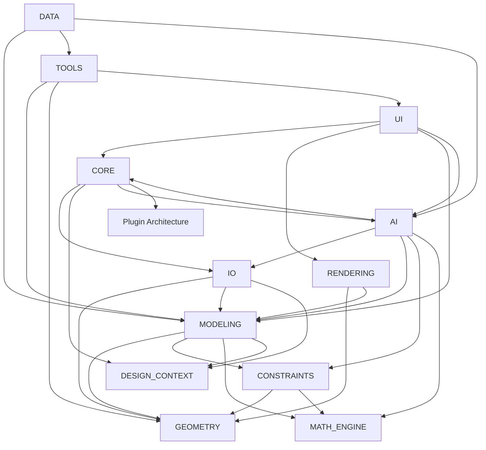

# EvilTech CAD Engineering Architecture

## 1. Purpose

EvilTech CAD is defined as a modular Engineering Operating System for design, analysis, simulation, and intelligent assistance across mechanical, civil, structural, architectural, manufacturing, robotics, aerospace, thermodynamic, fluid, materials, and computational engineering domains. This document establishes the architectural baseline for a multi-year engineering program and is intentionally implementation-agnostic.

## 2. Architectural Principles

1. Modularity over monolithics: each domain capability must remain independently evolvable.
2. Separation of concerns: geometry, math, constraints, modeling, rendering, IO, and AI must not be tightly coupled.
3. Extensibility by plugin: new engineering domains, solvers, exporters, and AI services must be introduced through defined extension points.
4. Data-centric design: the system must preserve authoritative project state and derive views from it.
5. Deterministic core: core modeling and constraint operations must be reproducible.
6. Progressive capability: the platform must support lightweight use cases before advanced simulation and AI features are enabled.
7. Traceability: every design decision, simulation run, and AI interaction should be auditable.
8. Resilience: failures in rendering, AI, or simulation must not corrupt project integrity.

---

## 3. Top-Level Module Architecture

### 3.1 Core

#### Mission
To provide the operating backbone for sessions, configuration, lifecycle orchestration, application state, event routing, and shared service coordination.

#### Responsibilities
- Own the application lifecycle and global runtime state.
- Manage sessions, projects, workspaces, and user context.
- Coordinate cross-module events and dependency initialization.
- Expose common configuration and service registry capabilities.

#### Non-responsibilities
- Direct geometry creation.
- Solving engineering constraints.
- Rendering visuals.
- Persisting project data beyond orchestration.

#### Internal components
- Application shell
- Configuration services
- Session and workspace managers
- Event bus and system services
- Project lifecycle coordinator

#### Dependencies
- UI for user entry
- IO for project load/save
- AI for optional assistant services
- Rendering for viewport integration
- Modeling, Geometry, Math, Constraints for domain operations

#### Public interfaces
- Application bootstrap and shutdown
- Project open/create/close operations
- Service registration and lookup
- Event publication and subscription
- Configuration accessors

#### Data inputs
- User commands
- Configuration files
- Project metadata
- Runtime environment settings

#### Data outputs
- Runtime state transitions
- Project lifecycle notifications
- Event messages
- Service availability information

#### Error handling philosophy
- Fail fast for invalid initialization states.
- Recover gracefully from module-level failures by isolating impacted subsystems.
- Preserve project state during partial failures.

#### Performance considerations
- Minimize initialization overhead.
- Avoid synchronous calls across unrelated subsystems.
- Cache service references and configuration objects.

#### Security considerations
- Validate configuration and plugin inputs.
- Protect privileged runtime operations.
- Avoid executing untrusted content without sandboxing.

#### Scalability considerations
- Support modular service expansion without changing the core runtime contract.
- Allow additional runtimes and plugin execution modes.

#### Future expansion opportunities
- Multi-user collaboration services
- Cloud-backed project synchronization
- Distributed simulation orchestration

#### Unit testing strategy
- Validate lifecycle transitions, state management, event routing, and configuration resolution.

#### Integration testing strategy
- Exercise startup, project open/save, plugin registration, and shutdown under realistic conditions.

#### Definition of Done
- Core runtime starts cleanly, routes events correctly, and preserves state across failure scenarios.

---

### 3.2 UI

#### Mission
To provide the human interface for navigation, modeling actions, command input, workspace selection, and user feedback.

#### Responsibilities
- Present home, project manager, 2D, 3D, AI, and simulation interfaces.
- Translate user actions into system commands.
- Surface status, errors, progress, and contextual help.

#### Non-responsibilities
- Implementing geometry math or solver behavior.
- Defining domain-specific engineering logic.

#### Internal components
- Command bar and menus
- Workspace views
- Project browser
- Tool palettes
- Notification and feedback surfaces

#### Dependencies
- Core for application state
- Modeling, Geometry, Constraints, Rendering, AI

#### Public interfaces
- Command dispatch
- View state updates
- Action callbacks
- Notification channels

#### Data inputs
- Mouse, keyboard, gestures, and command text
- Project and selection state

#### Data outputs
- User actions
- View updates
- Feedback and warnings

#### Error handling philosophy
- User-facing errors must be actionable and non-destructive.
- UI should degrade gracefully when backend services are unavailable.

#### Performance considerations
- Responsive interaction under large model and viewport loads.
- Progressive loading and throttled refreshes.

#### Security considerations
- Sanitize command input and plugin-provided UI content.
- Prevent unauthorized access to sensitive project data.

#### Scalability considerations
- Support multiple workspaces and large assemblies without blocking the interface.

#### Future expansion opportunities
- Voice-driven commands
- AR/VR interfaces
- Role-based dashboards

#### Unit testing strategy
- Validate view state transitions, command mapping, and user-feedback formatting.

#### Integration testing strategy
- Verify end-to-end interactions from UI command to backend action execution.

#### Definition of Done
- User workflows complete successfully and errors are clearly communicated.

---

### 3.3 AI

#### Mission
To provide intelligent engineering assistance, contextual guidance, analysis support, and optional automation for design and simulation workflows.

#### Responsibilities
- Manage AI assistant behavior and contextual prompts.
- Provide domain-aware analysis and suggestions.
- Coordinate optional AI-driven automation and feedback loops.

#### Non-responsibilities
- Replacing deterministic engineering calculations.
- Making authoritative design decisions without human review.

#### Internal components
- AI controller
- Context collectors
- Prompt and response orchestration
- Feedback storage and learning hooks
- Safety and policy layers

#### Dependencies
- Core for runtime state
- IO for project context access
- Geometry, Modeling, Constraints, Math, Simulation data

#### Public interfaces
- Assistant request/response workflow
- Context injection and memory access
- Feedback submission

#### Data inputs
- Project state
- Design history
- User prompts
- Simulation and analysis outputs

#### Data outputs
- Recommendations
- Explanations
- Automation suggestions
- Risk and design insights

#### Error handling philosophy
- AI failure must not corrupt design state or halt user workflows.
- Responses should degrade gracefully and clearly indicate uncertainty.

#### Performance considerations
- Context retrieval must be bounded and efficient.
- Long-running AI tasks should be asynchronous and cancellable.

#### Security considerations
- Prevent leakage of sensitive design data to unapproved AI services.
- Apply policy controls, access restrictions, and audit logging.

#### Scalability considerations
- Support multiple concurrent assistants and domain-specific models.

#### Future expansion opportunities
- Specialized engineering copilots
- Retrieval-augmented design context
- Autonomous simulation planning

#### Unit testing strategy
- Validate prompt construction, context selection, and response error handling.

#### Integration testing strategy
- Exercise AI interactions with real project data and validate safe handoff to modeling and simulation subsystems.

#### Definition of Done
- AI features provide helpful, safe, traceable assistance without compromising project integrity.

---

### 3.4 Geometry

#### Mission
To define and manage geometric primitives, spatial relationships, topology, transforms, and geometric operations.

#### Responsibilities
- Represent points, lines, curves, surfaces, solids, and meshes.
- Provide geometric operations such as intersections, transforms, and topology queries.
- Support 2D and 3D representations.

#### Non-responsibilities
- Constraint solving.
- Numerical optimization of engineering systems.
- Rendering presentation.

#### Internal components
- Primitive geometry types
- Transform and coordinate systems
- Topology and adjacency structures
- Intersection and boolean-related utilities

#### Dependencies
- Math engine for vector and matrix operations
- Modeling for feature-based operations
- Rendering for visualization

#### Public interfaces
- Geometry creation and query APIs
- Transform and topology operations
- Spatial relationship queries

#### Data inputs
- User sketch and feature data
- Derived data from modeling features
- Imported geometry from external files

#### Data outputs
- Geometry objects
- Topological relationships
- Spatial analysis results

#### Error handling philosophy
- Invalid geometry must be rejected with clear diagnostics.
- Self-consistency checks must guard against invalid topology.

#### Performance considerations
- Optimize for large assemblies and repeated geometric queries.
- Use cacheable spatial indexes where appropriate.

#### Security considerations
- Validate imported geometry to prevent malformed data from affecting runtime stability.

#### Scalability considerations
- Introduce hierarchical spatial structures for large models.

#### Future expansion opportunities
- Parametric geometric kernels
- NURBS and advanced surface modeling
- Physics-based geometry adaptation

#### Unit testing strategy
- Validate primitive creation, transforms, intersection logic, and topology consistency.

#### Integration testing strategy
- Confirm geometric operations work correctly through modeling and rendering pipelines.

#### Definition of Done
- Geometry operations are stable, deterministic, and correctly integrated with modeling and rendering.

---

### 3.5 Modeling

#### Mission
To translate geometry and design intent into feature-based, editable engineering models.

#### Responsibilities
- Define parts, assemblies, features, patterns, sweeps, extrusions, lofts, shells, and boolean operations.
- Manage model history and feature relationships.
- Support parametric change propagation.

#### Non-responsibilities
- Low-level geometric primitives beyond feature operations.
- Final rendering presentation.

#### Internal components
- Part and assembly models
- Feature operations
- Patterning and operations libraries
- Feature history and dependency tracking

#### Dependencies
- Geometry
- Constraints
- Math engine
- Design context

#### Public interfaces
- Feature creation and modification
- Assembly composition
- Parametric update services
- Model query interfaces

#### Data inputs
- Geometry primitives
- Constraint definitions
- User feature operations
- Imported design data

#### Data outputs
- Feature-based models
- Assembly structures
- Derived geometry

#### Error handling philosophy
- Feature failures must leave the model in a consistent state.
- Changes should be reversible or rollback-capable.

#### Performance considerations
- Recompute only impacted features when possible.
- Use dependency graphs to limit update scope.

#### Security considerations
- Verify imported feature definitions and scripts before execution.

#### Scalability considerations
- Support complex assemblies with incremental updates and managed histories.

#### Future expansion opportunities
- Manufacturing process-aware modeling
- Generative design workflows
- Multi-body systems and kinematics

#### Unit testing strategy
- Validate feature behavior, update propagation, and history consistency.

#### Integration testing strategy
- Confirm modeling changes correctly drive geometry, constraints, rendering, and persistence.

#### Definition of Done
- Parametric models update predictably and preserve editability across major workflows.

---

### 3.6 Constraints

#### Mission
To enforce and solve design constraints that represent engineering intent and physical feasibility.

#### Responsibilities
- Manage dimensional, geometric, tolerance, and assembly constraints.
- Resolve constraint networks and report conflicts.
- Support design optimization and constraint-based editing.

#### Non-responsibilities
- Defining the geometry itself.
- Rendering or simulation execution.

#### Internal components
- Constraint registry
- Dimensional constraint solver
- Geometric constraint solver
- Assembly constraint solver
- Tolerance rules and compliance logic

#### Dependencies
- Geometry
- Math engine
- Modeling
- Design context

#### Public interfaces
- Constraint registration and validation
- Solve requests
- Conflict diagnostics
- Constraint dependency queries

#### Data inputs
- Geometry entities and relationships
- Design intent rules
- User-entered constraints

#### Data outputs
- Solved geometry states
- Constraint satisfaction reports
- Conflict and warning diagnostics

#### Error handling philosophy
- Constraint failures must be explicit and diagnostic rather than silent.
- Incomplete or conflicting systems should remain recoverable.

#### Performance considerations
- Use incremental solving where changes are local.
- Avoid full-system solves when unnecessary.

#### Security considerations
- Ensure constraint definitions cannot trigger unsafe behavior or malformed state.

#### Scalability considerations
- Support large constraint graphs with decomposition and selective solving.

#### Future expansion opportunities
- Optimization-driven design spaces
- Simulation-informed constraints
- Multi-physics feasibility constraints

#### Unit testing strategy
- Validate solver correctness for simple and conflicting systems.

#### Integration testing strategy
- Verify constraints propagate correctly through model updates and feature revisions.

#### Definition of Done
- The solver resolves valid systems, reports conflicts clearly, and preserves model consistency.

---

### 3.7 Math Engine

#### Mission
To provide the numerical and symbolic foundation for geometry, transforms, optimization, simulation, and solver behavior.

#### Responsibilities
- Manage algebra, vectors, matrices, quaternions, numerical methods, interpolation, and transforms.
- Support tolerance handling and solver primitives.

#### Non-responsibilities
- User interface or project lifecycle management.
- Domain-specific simulation implementation.

#### Internal components
- Linear algebra utilities
- Numerical analysis routines
- Interpolation and transform services
- Tolerance and solver support functions

#### Dependencies
- Geometry
- Constraints
- Modeling
- Simulation-related subsystems

#### Public interfaces
- Numeric operations and transformations
- Solver support routines
- Tolerance and precision services

#### Data inputs
- Geometric coordinates and parameters
- Constraint values
- Simulation inputs

#### Data outputs
- Computed numerical results
- Transform matrices
- Solver-ready values

#### Error handling philosophy
- Numerical failure should yield explicit error states and fallback strategies.
- Precision issues must be detectable and traceable.

#### Performance considerations
- Favor optimized numerical kernels and limited allocations.
- Provide stable algorithms for large-scale systems.

#### Security considerations
- Numerical routines must be deterministic and free from untrusted execution paths.

#### Scalability considerations
- Support high-dimensional and large-system calculations through decomposition.

#### Future expansion opportunities
- Symbolic engine integration
- GPU-accelerated numerical methods
- Advanced optimization libraries

#### Unit testing strategy
- Validate core numeric routines, edge cases, and tolerance behavior.

#### Integration testing strategy
- Verify math outputs feed correctly into geometry, constraints, and simulation.

#### Definition of Done
- Core numerical operations are accurate, reliable, and interoperable across engineering modules.

---

### 3.8 Design Context

#### Mission
To preserve design intent, revision history, annotations, bookmarks, state snapshots, and contextual metadata across the project lifecycle.

#### Responsibilities
- Track design history and revisions.
- Capture annotations, bookmarks, and contextual design state.
- Support undo/redo and state comparison workflows.

#### Non-responsibilities
- Creating geometry or solving constraints.
- Storing project payloads unrelated to design intent.

#### Internal components
- Design history tracker
- Annotation and bookmark services
- Design state snapshots
- Feature tree and metadata stores
- Undo/redo management

#### Dependencies
- Core
- Modeling
- IO

#### Public interfaces
- State capture and restore
- History inspection
- Annotation and bookmark operations

#### Data inputs
- Modeling actions
- User annotations
- Revision events

#### Data outputs
- Design history records
- State snapshots
- Metadata and annotations

#### Error handling philosophy
- History recording must not break the current workflow if records are incomplete.
- State restoration must be transactional or recoverable.

#### Performance considerations
- Log state changes efficiently without excessive memory growth.

#### Security considerations
- Protect sensitive design commentary and metadata from unauthorized access.

#### Scalability considerations
- Support large histories with compact storage and selective retention.

#### Future expansion opportunities
- AI-assisted design rationale capture
- Collaborative review annotations
- Change-impact analysis

#### Unit testing strategy
- Validate snapshot creation, undo/redo behavior, and annotation handling.

#### Integration testing strategy
- Verify design context updates during model creation, constraint updates, and project load/save.

#### Definition of Done
- Design intent remains traceable and recoverable through revisions and edits.

---

### 3.9 IO

#### Mission
To manage project import, export, persistence, file handling, and interoperability with external engineering formats.

#### Responsibilities
- Load and save projects and model data.
- Support CAD and engineering interchange formats.
- Maintain file and workspace integrity.

#### Non-responsibilities
- Defining the geometry or domain behavior.
- Rendering display logic.

#### Internal components
- Project loader and saver
- Importer and exporter services
- File manager
- Format-specific translators such as DXF, STEP, IGES, OBJ, STL

#### Dependencies
- Core
- Geometry
- Modeling
- Design context

#### Public interfaces
- Import/export operations
- File open/save and versioning
- Format validation and conversion

#### Data inputs
- File content and user instructions
- External model data

#### Data outputs
- Project data structures
- External file artifacts
- Import diagnostics

#### Error handling philosophy
- Import/export failures should leave the project intact and provide actionable diagnostics.
- Partial imports must be non-destructive.

#### Performance considerations
- Stream large files and support incremental loads where possible.

#### Security considerations
- Validate file origins and content before materializing data into the workspace.

#### Scalability considerations
- Support large assemblies and long histories through chunked reads and writes.

#### Future expansion opportunities
- Native cloud storage integration
- Versioned data exchange
- Semantic interoperability with external engineering platforms

#### Unit testing strategy
- Validate file parsing, schema compliance, and round-trip behavior.

#### Integration testing strategy
- Exercise full import/export flows with representative engineering files.

#### Definition of Done
- Project data can be reliably persisted and exchanged without data corruption or ambiguous state.

---

### 3.10 Rendering

#### Mission
To present model data visually in 2D and 3D views with appropriate lighting, materials, cameras, overlays, and scene management.

#### Responsibilities
- Manage rendering scenes, viewport state, camera controls, materials, lighting, textures, and overlays.
- Deliver visual feedback for modeling, analysis, and simulation.

#### Non-responsibilities
- Defining the engineering semantics of the model.
- Solving physics or constraints.

#### Internal components
- Renderer
- Scene graph
- Camera and viewport model
- Lighting and material systems
- Overlay and annotation layers

#### Dependencies
- Geometry
- Modeling
- Core
- UI

#### Public interfaces
- Scene update and refresh operations
- Camera and viewport control
- Render mode selection

#### Data inputs
- Geometry and scene data
- View settings and user interactions

#### Data outputs
- Rendered frames and visual artifacts
- View-state updates

#### Error handling philosophy
- Rendering failures should not impact model integrity.
- Fallback to simpler representations when advanced rendering is unavailable.

#### Performance considerations
- Use level-of-detail, culling, and scene batching for large models.

#### Security considerations
- Prevent malicious assets or textures from destabilizing the rendering pipeline.

#### Scalability considerations
- Support multi-viewport, large assembly, and high-resolution workflows.

#### Future expansion opportunities
- Real-time ray tracing
- GPU acceleration
- VR and mixed-reality integration

#### Unit testing strategy
- Validate scene composition, camera logic, material selection, and view updates.

#### Integration testing strategy
- Confirm rendering reflects the current model state under editing and simulation scenarios.

#### Definition of Done
- The visual system remains responsive, accurate, and synchronized with the underlying engineering model.

---

### 3.11 Tools

#### Mission
To deliver domain-focused operations such as measure, inspect, move, rotate, scale, mirror, section, fillet, and chamfer.

#### Responsibilities
- Provide engineering utility operations on selected geometry or models.
- Support editing workflows and analysis preparation.

#### Non-responsibilities
- Core geometry creation beyond tool-specific operations.
- Full simulation or optimization logic.

#### Internal components
- Measurement and inspection tools
- Transform tools
- Sectioning and analysis utilities
- Feature editing tools

#### Dependencies
- Geometry
- Modeling
- UI

#### Public interfaces
- Tool execution and parameterization
- Selection-based operations
- Result reporting

#### Data inputs
- User selection and parameters
- Current model state

#### Data outputs
- Modified geometry or model state
- Derived measurement and analysis outputs

#### Error handling philosophy
- Tool execution should be reversible and provide diagnostics for invalid selections.

#### Performance considerations
- Support interactive operations on large selections.

#### Security considerations
- Validate tool inputs and operation parameters before execution.

#### Scalability considerations
- Enable batching for repetitive operations across large models.

#### Future expansion opportunities
- Parametric design tools
- Automated manufacturing preparation tools
- Optimization tooling

#### Unit testing strategy
- Validate tool results, parameter handling, and selection edge cases.

#### Integration testing strategy
- Verify tools produce consistent model changes and maintain UI synchronization.

#### Definition of Done
- Engineering tools operate correctly, preserve design state, and produce predictable results.

---

### 3.12 Data

#### Mission
To provide standardized engineering data libraries and domain content such as materials, fasteners, bearings, gears, standards, templates, and textures.

#### Responsibilities
- Supply reusable domain definitions and catalog data.
- Ensure consistency of standards-based engineering references.

#### Non-responsibilities
- Runtime execution of model operations.
- Persistence of project-specific state.

#### Internal components
- Materials catalog
- Fasteners and bearings libraries
- Gears and standards definitions
- Templates and textures

#### Dependencies
- Core for access patterns
- Modeling and tools for consumption

#### Public interfaces
- Data lookup and retrieval
- Catalog query and filtering

#### Data inputs
- Authoritative domain definitions
- User selection and filters

#### Data outputs
- Structured engineering data objects
- Reusable design references

#### Error handling philosophy
- Missing or invalid catalog data must surface as explicit errors with fallback options.

#### Performance considerations
- Cache frequently used library definitions.

#### Security considerations
- Prevent accidental use of malformed or tampered data sources.

#### Scalability considerations
- Allow domain-specific catalog extension without reworking the interface.

#### Future expansion opportunities
- External standards APIs
- Enterprise libraries and compliance packs
- ML-driven catalog recommendations

#### Unit testing strategy
- Validate correctness, consistency, and completeness of catalog entries.

#### Integration testing strategy
- Confirm that data selections create valid model and simulation inputs.

#### Definition of Done
- Domain data is accurate, discoverable, and usable across workflows.

---

### 3.13 Utils

#### Mission
To provide shared infrastructure utilities that support other modules without owning domain logic.

#### Responsibilities
- Provide general-purpose helpers for logging, conversion, path handling, validation, and common computational tasks.

#### Non-responsibilities
- Implementing engineering-domain behavior itself.

#### Internal components
- Shared utility libraries
- Validation and serialization helpers
- Common file and path helpers

#### Dependencies
- All modules may depend on it, but it should not depend on high-level domain modules.

#### Public interfaces
- Common helper functions and service primitives

#### Data inputs
- Generic data structures and configuration values

#### Data outputs
- Normalized values, helper results, or processed records

#### Error handling philosophy
- Utilities should return explicit errors and avoid crashing larger workflows.

#### Performance considerations
- Keep generic helpers lightweight and deterministic.

#### Security considerations
- Avoid broad filesystem or process access unless explicitly required.

#### Scalability considerations
- Remain stable under frequent use by large subsystems.

#### Future expansion opportunities
- Policy and governance helpers
- Shared metadata utilities
- Cross-platform compatibility helpers

#### Unit testing strategy
- Validate behavioral correctness and edge cases for common utility routines.

#### Integration testing strategy
- Ensure utility functions behave correctly under real system workflows.

#### Definition of Done
- Utilities are reliable, generic, and broadly reusable.

---

### 3.14 Test

#### Mission
To verify correctness, regression safety, and integration behavior of the platform.

#### Responsibilities
- Define and execute unit, integration, and system-level tests.
- Guard against rework caused by regressions.
- Establish quality gates for release readiness.

#### Non-responsibilities
- Implementing system features.
- Replacing engineering review and validation.

#### Internal components
- Unit test suites
- Integration test suites
- Regression and acceptance tests
- Quality reporting and coverage analysis

#### Dependencies
- All subsystems under test

#### Public interfaces
- Test execution entry points
- Failure diagnostics and reporting

#### Data inputs
- Expected behavior and reference scenarios
- System state and fixture data

#### Data outputs
- Test results, coverage, and quality metrics

#### Error handling philosophy
- Testing should expose failures clearly and preserve reproducibility.

#### Performance considerations
- Keep targeted tests fast and deterministic.

#### Security considerations
- Avoid exposing secrets or protected data in test fixtures.

#### Scalability considerations
- Support broad test coverage as the platform grows.

#### Future expansion opportunities
- Continuous integration and model-based testing
- Formal verification and acceptance automation

#### Unit testing strategy
- Test each subsystem in isolation with realistic boundaries.

#### Integration testing strategy
- Exercise cross-module workflows and regression scenarios.

#### Definition of Done
- The product has sufficient automated coverage and a documented release quality baseline.

---

## 4. Complete System Architecture

The system is best understood as a layered platform:

1. Presentation Layer: UI, workspaces, command interactions.
2. Application Layer: Core runtime, session state, event routing, configuration.
3. Domain Engineering Layer: Geometry, Modeling, Constraints, Math, Tools, Data.
4. Analysis and Simulation Layer: Simulation center, solvers, optimization, physics and engineering analysis services.
5. Intelligence Layer: AI assistant, context retrieval, recommendations, automation.
6. Persistence and Interoperability Layer: IO, project save/load, file exchange, external standards.
7. Infrastructure Layer: Utils, logging, security, performance monitoring, plugins.

This architecture supports both lightweight CAD operations and advanced engineering simulation pipelines through common core services and module-specific extension points.

---

## 5. System Dependency Graph

---

## 6. Data Flow Architecture

The platform should treat project state as the authoritative source of truth. All views, analyses, exports, and AI requests should derive from that state rather than maintain independent copies. The expected flow is:

1. User action enters through UI.
2. Core routes the action to the relevant service.
3. Modeling or geometry services update the canonical project state.
4. Constraints and math services validate and resolve the change.
5. Rendering and UI views reflect the updated state.
6. Design context records the change and optional AI services interpret it.
7. IO services persist the project and export interchange artifacts.

---

## 7. Rendering Pipeline

1. Scene collection from current model state.
2. Geometry preparation and transform application.
3. Visibility, culling, and level-of-detail selection.
4. Material, lighting, and camera evaluation.
5. Rasterization or scene rendering.
6. Overlay application for annotations, tools, and diagnostics.
7. UI refresh and interaction state update.

---

## 8. Project Lifecycle

1. Create or open project.
2. Initialize runtime state and workspace context.
3. Load project data and context history.
4. Build model graph, views, and dependency structures.
5. Enable user editing, analysis, and simulation workflows.
6. Persist changes incrementally and on explicit save.
7. Close or archive project safely.

---

## 9. Simulation Lifecycle

1. Define simulation scope and physical assumptions.
2. Transform model and constraints into solver-ready representations.
3. Configure material, boundary, and environmental parameters.
4. Execute simulation and collect numerical outputs.
5. Validate and visualize results.
6. Record results in design context and support iterative refinement.

---

## 10. AI Interaction Lifecycle

1. Collect relevant project, model, and history context.
2. Form an AI request with explicit scope and safety constraints.
3. Process the request through the assistant service.
4. Return recommendations, analysis, or automation suggestions.
5. Present results to the user with provenance and confidence indicators.
6. Record feedback and optionally update context memory.

---

## 11. Event Flow

The event architecture should be asynchronous where practical and deterministic where necessary. Events should include:
- User command events
- Project lifecycle events
- Model change events
- Constraint solve events
- Simulation completion events
- Render refresh events
- AI request/response events
- IO completion and failure events

The event bus must preserve ordering where required and support subscription by domain modules without introducing circular dependencies.

---

## 12. Startup Sequence

1. Initialize core runtime and configuration.
2. Register foundational services and plugin entry points.
3. Create default workspace and project manager state.
4. Initialize UI shell and viewport containers.
5. Load user preferences and last project context.
6. Initialize optional AI and simulation services.
7. Present home screen or project open workflow.

---

## 13. Shutdown Sequence

1. Stop active simulations and AI tasks.
2. Flush pending UI and IO operations.
3. Persist unsaved state or prompt the user.
4. Disconnect services and release resources.
5. Save runtime logs and diagnostics.
6. Terminate event processing cleanly.

---

## 14. Memory Management Philosophy

Memory should be managed according to explicit ownership and lifecycle boundaries. Long-lived project state should be centralized and reused by dependent services. Temporary rendering, simulation, and AI context should be bounded and released deterministically. The system should avoid hidden copies of large models where possible and use shared references or immutable snapshots where appropriate.

---

## 15. Performance Philosophy

The platform must prioritize responsiveness, especially in interactive workflows such as sketching, manipulation, navigation, and design iteration. Expensive operations such as solving, simulation, and AI inference should be asynchronous or incremental. The architecture should favor selective recomputation over full-system refreshes.

---

## 16. Threading Philosophy

The platform should separate user-interactive workloads from heavy computational work. A reasonable model is:
- UI thread for interaction and immediate feedback.
- Background worker pool for simulation, IO, and model updates.
- Optional GPU or accelerator resources for rendering and large numerical workloads.
- AI services should remain asynchronous and cancellable.

Threading policy should prioritize determinism and isolation over unnecessary concurrency.

---

## 17. Error Recovery Philosophy

Errors must be handled at the level closest to the affected capability. The architecture should support:
- Graceful degradation for optional subsystems
- Transactional updates for project modifications
- Rollback or snapshot restore for failed model changes
- Non-destructive import/export failures
- Clear user-visible diagnostics and logs

Recovery policies should preserve project integrity even when advanced features fail.

---

## 18. Logging Philosophy

Logging must be structured, role-based, and traceable. The system should log:
- User actions and state transitions
- Module-level events and failures
- Simulation and solver outcomes
- AI request/response metadata and policy decisions
- Persistence and import/export activity

Logs should be sufficiently detailed for support, traceability, and postmortem analysis without overwhelming the user or compromising security.

---

## 19. Plugin Architecture

The plugin model should be explicit and contract-driven. Plugins must be able to extend:
- User interface commands
- Modeling operations
- Constraint or solver behavior
- Rendering capabilities
- IO formats
- AI assistant capabilities
- Simulation domains

Plugins must be loaded through a controlled registry, validated before activation, and isolated from core state except through defined interfaces.

---

## 20. Long-Term Engineering Roadmap Guidance

The architecture should evolve in phases:
1. Foundation: core runtime, project lifecycle, geometry, modeling, and persistence.
2. Intelligence: constraints, math, rendering, and AI assistance.
3. Simulation: physics, thermodynamics, fluid, orbital, and manufacturing workflows.
4. Ecosystem: plugin expansion, external standards, collaboration, and enterprise deployment.

This roadmap preserves architectural integrity while allowing domain expansions over time.
