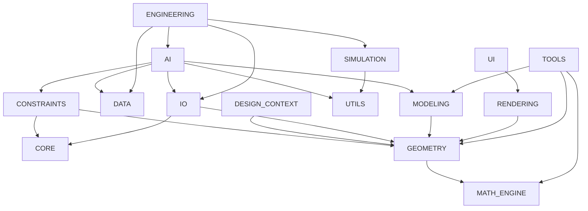

# Architecture Violation Report

## Summary

No circular dependency violations remain.

- Package-level cycles: `0`
- Module-level cycles: `0`

The remaining architecture violations are boundary violations: packages directly import peer implementation modules instead of interacting only through package-level APIs, contracts, or adapters.

## Dependency Graph

## Concrete Coupling Sites

Measured file-level cross-package concrete import counts:

- `AI`: `18`
- `CONSTRAINTS`: `12`
- `DESIGN_CONTEXT`: `1`
- `ENGINEERING`: `4`
- `GEOMETRY`: `10`
- `IO`: `11`
- `MODELING`: `2`
- `RENDERING`: `8`
- `SIMULATION`: `1`
- `TOOLS`: `20`
- `UI`: `2`

## Highest-Impact Violations

### UI directly imports Rendering internals

- [UI/viewport.py](/workspaces/CAD_UNIVERSAL/EVILTECH_CAD/UI/viewport.py)
  - imports `RENDERING.camera`
  - imports `RENDERING.renderer`

Impact: UI cannot be swapped independently from Rendering.

### Engineering directly imports AI, IO, Simulation, and Data internals

- [ENGINEERING/ai_integration.py](/workspaces/CAD_UNIVERSAL/EVILTECH_CAD/ENGINEERING/ai_integration.py)
- [ENGINEERING/material_integration.py](/workspaces/CAD_UNIVERSAL/EVILTECH_CAD/ENGINEERING/material_integration.py)
- [ENGINEERING/sample_project_generator.py](/workspaces/CAD_UNIVERSAL/EVILTECH_CAD/ENGINEERING/sample_project_generator.py)
- [ENGINEERING/simulation_integration.py](/workspaces/CAD_UNIVERSAL/EVILTECH_CAD/ENGINEERING/simulation_integration.py)

Impact: Engineering is not independently replaceable.

### AI directly imports Modeling, IO, Constraints, and Data internals

- [AI/context_builder.py](/workspaces/CAD_UNIVERSAL/EVILTECH_CAD/AI/context_builder.py)
- [AI/ANALYSIS/design_snapshot_builder.py](/workspaces/CAD_UNIVERSAL/EVILTECH_CAD/AI/ANALYSIS/design_snapshot_builder.py)
- [AI/DATA/project_loader.py](/workspaces/CAD_UNIVERSAL/EVILTECH_CAD/AI/DATA/project_loader.py)
- [AI/DATA/material_loader.py](/workspaces/CAD_UNIVERSAL/EVILTECH_CAD/AI/DATA/material_loader.py)
- [AI/DATA/geometry_loader.py](/workspaces/CAD_UNIVERSAL/EVILTECH_CAD/AI/DATA/geometry_loader.py)
- [AI/DATA/assembly_loader.py](/workspaces/CAD_UNIVERSAL/EVILTECH_CAD/AI/DATA/assembly_loader.py)

Impact: AI depends on peer implementations rather than stable domain adapters.

### Rendering, Constraints, and IO import Geometry internals directly

- [RENDERING/renderer.py](/workspaces/CAD_UNIVERSAL/EVILTECH_CAD/RENDERING/renderer.py)
- [RENDERING/camera.py](/workspaces/CAD_UNIVERSAL/EVILTECH_CAD/RENDERING/camera.py)
- [RENDERING/overlays.py](/workspaces/CAD_UNIVERSAL/EVILTECH_CAD/RENDERING/overlays.py)
- [CONSTRAINTS/constraint_solver.py](/workspaces/CAD_UNIVERSAL/EVILTECH_CAD/CONSTRAINTS/constraint_solver.py)
- [CONSTRAINTS/geometric_constraints.py](/workspaces/CAD_UNIVERSAL/EVILTECH_CAD/CONSTRAINTS/geometric_constraints.py)
- [CONSTRAINTS/dimensional_constraints.py](/workspaces/CAD_UNIVERSAL/EVILTECH_CAD/CONSTRAINTS/dimensional_constraints.py)
- [IO/dxf_io.py](/workspaces/CAD_UNIVERSAL/EVILTECH_CAD/IO/dxf_io.py)
- [IO/iges_io.py](/workspaces/CAD_UNIVERSAL/EVILTECH_CAD/IO/iges_io.py)
- [IO/obj_io.py](/workspaces/CAD_UNIVERSAL/EVILTECH_CAD/IO/obj_io.py)
- [IO/step_io.py](/workspaces/CAD_UNIVERSAL/EVILTECH_CAD/IO/step_io.py)
- [IO/stl_io.py](/workspaces/CAD_UNIVERSAL/EVILTECH_CAD/IO/stl_io.py)

Impact: Geometry cannot be replaced independently.

## Resolved During Audit

Two module-level cycles were removed during this audit baseline hardening:

- IO shared-model cycle eliminated by [IO/project_models.py](/workspaces/CAD_UNIVERSAL/EVILTECH_CAD/IO/project_models.py)
- Modeling shared-body cycle eliminated by [MODELING/body.py](/workspaces/CAD_UNIVERSAL/EVILTECH_CAD/MODELING/body.py)

## Conclusion

The repository is cycle-free but not interface-pure. The production baseline is stable enough for continued development, but adapter extraction remains the highest-priority architectural hardening task.