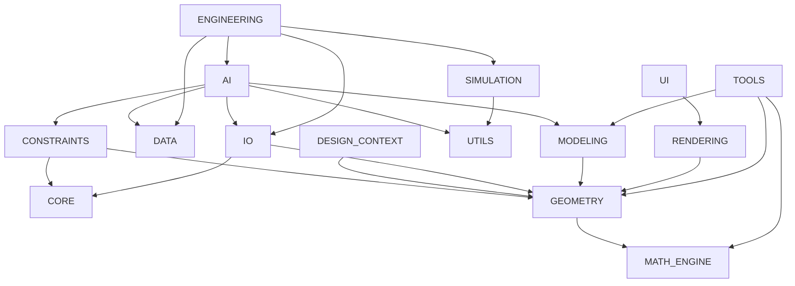

# Dependency Graph

## Package-Level Graph

## Cycle Status

- Package-level cycles: none
- Module-level cycles: none

## Notes

- The graph is acyclic after the extraction of shared IO and Modeling support modules.
- Acyclic structure does not imply clean architecture boundaries; see [ARCHITECTURE_VIOLATION_REPORT.md](/workspaces/CAD_UNIVERSAL/EVILTECH_CAD/ARCHITECTURE_VIOLATION_REPORT.md).

## Root Entry Point Dependencies

- [main.py](/workspaces/CAD_UNIVERSAL/EVILTECH_CAD/main.py) imports `CORE.application`, `CORE.configuration`, `CORE.constants`, and `CORE.exceptions`

## Conclusion

The repository currently follows a stable acyclic dependency structure suitable for a production baseline, but still contains direct concrete package coupling that should be reduced over time.