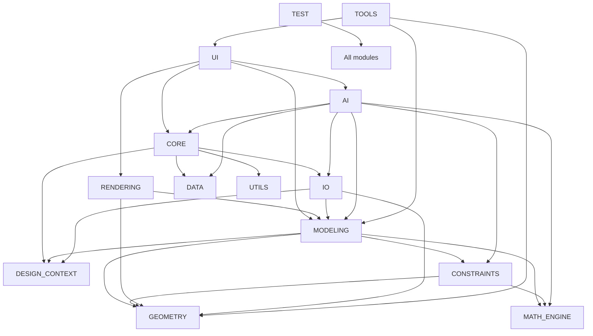

# EvilTech CAD Interface Contracts

## 1. Purpose

This document defines the mandatory interface contracts for the EvilTech CAD platform. It is normative for all future implementation work. No module may violate these contracts. No implementation code is included.

## 2. Contract Principles

1. Public interfaces are authoritative and must remain stable across compatible releases.
2. Private implementation details are not part of the public contract.
3. Circular dependencies are not permitted.
4. Each module owns a clearly defined state boundary.
5. All inter-module communication must occur through documented interfaces and events.
6. Threading and memory ownership must be explicit.
7. All failures must be represented as typed, recoverable error states.
8. Versioning must be explicit and backward-compatible where possible.

---

## 3. Contract Structure by Top-Level Module

### 3.1 CORE

#### Mission
To provide application lifecycle orchestration, project context, configuration management, service discovery, runtime events, and cross-module coordination.

#### Responsibilities
- Initialize and shut down the application runtime.
- Manage project, session, and workspace state.
- Register and resolve services.
- Route events between subsystems.
- Enforce runtime configuration and policy.

#### Public API
- initialize_application(config)
- shutdown_application()
- create_project(project_spec)
- open_project(project_id)
- close_project(project_id)
- save_project(project_id)
- register_service(service_name, impl)
- resolve_service(service_name)
- publish_event(event)
- subscribe(event_type, handler)
- get_runtime_state()

#### Private Components
- Runtime registry
- Session manager
- Project coordinator
- Configuration validator
- Event dispatcher
- State snapshot manager

#### Input Objects
- ApplicationConfig
- ProjectSpec
- SessionContext
- EventEnvelope

#### Output Objects
- RuntimeState
- ProjectHandle
- ServiceHandle
- EventResult

#### Events Published
- application.started
- application.stopped
- project.created
- project.opened
- project.closed
- project.saved
- project.failed
- service.registered
- service.resolved

#### Events Consumed
- ui.command.executed
- model.changed
- render.requested
- io.load.completed
- io.save.completed
- ai.request.completed

#### Dependencies
- UI
- AI
- IO
- Rendering
- Modeling
- Geometry
- Constraints
- Design Context
- Utils

#### Dependency Rules
- Core may depend on all modules but must not be dependent on them in a way that creates bidirectional runtime ownership.
- Core must not call a UI component directly from a domain service.

#### Threading Requirements
- Core orchestration runs on the main application thread.
- Long-running operations must be delegated asynchronously.

#### Memory Ownership
- Core owns runtime state and service registries.
- Child modules must not retain ownership of global runtime objects without explicit contract.

#### Error Handling
- Failures must return typed errors and preserve runtime integrity.
- Partial initialization must be recoverable.

#### Logging Requirements
- Log application lifecycle transitions, service registration, and project state events.

#### Testing Requirements
- Unit tests for service registry, lifecycle transitions, and event routing.
- Integration tests for startup, project open/save, and shutdown.

#### Performance Targets
- Application initialization under 3 seconds for a baseline configuration.
- Event dispatch latency under 50 ms for local events.

#### Versioning Strategy
- Semantic versioning for public interfaces.
- Interface additions must be backward-compatible.

#### Future Compatibility
- Must support plugin-based extension and multi-runtime deployment.

---

### 3.2 UI

#### Mission
To provide user interaction, workspace views, commands, feedback, and user-facing state representation.

#### Responsibilities
- Present the home screen, project manager, 2D/3D workspaces, AI workspace, and simulation workspace.
- Translate user actions into domain commands.
- Render status and errors to the user.

#### Public API
- initialize_ui(application_context)
- show_workspace(workspace_id)
- handle_command(command)
- set_selection(selection)
- refresh_view(view_id)
- show_notification(message)
- request_confirmation(prompt)
- bind_view_model(view_model)

#### Private Components
- Command dispatcher
- View state manager
- Workspace controller
- Notification service
- Selection controller

#### Input Objects
- UICommand
- WorkspaceSelection
- ViewStateRequest
- NotificationMessage

#### Output Objects
- UIActionResult
- ViewUpdate
- SelectionState
- NotificationResult

#### Events Published
- ui.command.executed
- ui.selection.changed
- ui.workspace.changed
- ui.notification.emitted

#### Events Consumed
- model.changed
- render.updated
- project.state.changed
- ai.response.received

#### Dependencies
- Core
- Rendering
- Modeling
- AI
- Constraints

#### Dependency Rules
- UI may depend on domain services but must not own project state directly.
- UI must not invoke persistence or solver services without going through core or application services.

#### Threading Requirements
- UI operations run on the UI thread.
- Heavy operations must be pushed to background workers.

#### Memory Ownership
- UI owns transient view state only.
- It must not own canonical project data.

#### Error Handling
- User-facing failures must be non-destructive and actionable.

#### Logging Requirements
- Log command execution, selection state changes, and notification emission.

#### Testing Requirements
- Unit tests for command handling and state mapping.
- Integration tests for UI to backend workflow execution.

#### Performance Targets
- UI response under 100 ms for common commands.
- View refresh under 250 ms for moderate scene sizes.

#### Versioning Strategy
- Stable command payload contracts and view model contracts.

#### Future Compatibility
- Must support future multi-window, multi-viewport, and accessibility workflows.

---

### 3.3 AI

#### Mission
To provide safe, contextual, traceable, and domain-aware assistance for engineering workflows.

#### Responsibilities
- Manage AI requests and responses.
- Gather contextual information from project state.
- Produce suggestions, diagnostics, and workflow assistance.
- Ensure policy compliance and traceability.

#### Public API
- initialize_ai(service_config)
- submit_request(request)
- cancel_request(request_id)
- get_request_status(request_id)
- register_context_provider(provider_name, provider)
- register_policy(policy)

#### Private Components
- Request orchestrator
- Context collector
- Policy engine
- Response parser
- Audit logger
- Model adapter

#### Input Objects
- AIRequest
- AIContext
- AIPolicy
- AIResponseOptions

#### Output Objects
- AIResponse
- AIRequestStatus
- AIContextSnapshot
- AIError

#### Events Published
- ai.request.started
- ai.request.completed
- ai.request.failed
- ai.request.cancelled

#### Events Consumed
- project.state.changed
- model.changed
- simulation.completed
- constraint.solved

#### Dependencies
- Core
- IO
- Modeling
- Constraints
- Math Engine
- Design Context

#### Dependency Rules
- AI must not mutate canonical project state directly without an explicit command workflow.
- AI must never bypass policy enforcement.

#### Threading Requirements
- AI requests must be asynchronous and cancellable.
- Long-running inference must not block the UI thread.

#### Memory Ownership
- AI owns transient request context and response buffers.
- It must not retain canonical project state beyond request scope unless explicitly owned by design context.

#### Error Handling
- AI failures must return structured errors and never corrupt project state.

#### Logging Requirements
- Log request scope, context selection, response provenance, confidence, and policy decisions.

#### Testing Requirements
- Unit tests for policy enforcement, context selection, and response parsing.
- Integration tests with real project data and failure modes.

#### Performance Targets
- Request acknowledgement under 200 ms.
- Context retrieval within 1 second for standard project sizes.

#### Versioning Strategy
- Version request/response contracts and provider adapters separately.

#### Future Compatibility
- Must support multiple model providers and locally hosted inference.

---

### 3.4 GEOMETRY

#### Mission
To represent and operate on geometric entities and spatial relationships.

#### Responsibilities
- Define geometric primitives.
- Provide transforms, topological operations, and spatial queries.
- Support import and export of geometry entities.

#### Public API
- create_point(spec)
- create_line(spec)
- create_curve(spec)
- create_surface(spec)
- create_solid(spec)
- create_mesh(spec)
- transform_geometry(geometry, transform)
- intersect(geometry_a, geometry_b)
- boolean_operation(operation, geometry_a, geometry_b)
- query_topology(geometry)

#### Private Components
- Primitive registry
- Topology manager
- Transform engine
- Spatial index
- Geometry validator

#### Input Objects
- GeometrySpec
- TransformSpec
- TopologyQuery
- BooleanOperationSpec

#### Output Objects
- GeometryEntity
- GeometryResult
- TopologyReport
- SpatialQueryResult

#### Events Published
- geometry.changed
- geometry.validation.failed

#### Events Consumed
- model.updated
- io.import.completed

#### Dependencies
- Math Engine
- Modeling

#### Dependency Rules
- Geometry must not depend on rendering or UI for core semantics.
- Geometry may expose data to rendering through read-only views.

#### Threading Requirements
- Geometry operations may run in worker threads for large computations.
- Thread-safe access to immutable geometry entities is required.

#### Memory Ownership
- Geometry entities are owned by the modeling or project layer unless explicitly shared.
- Shared instances must be immutable or copy-on-write.

#### Error Handling
- Invalid geometry must return structured validation errors.
- Topology inconsistencies must be reported explicitly.

#### Logging Requirements
- Log geometry creation, transformation, validation failure, and topology events.

#### Testing Requirements
- Unit tests for primitives, transforms, intersections, and topology.
- Integration tests with modeling and rendering pipelines.

#### Performance Targets
- Primitive operations under 10 ms for common cases.
- Spatial queries should scale sublinearly for indexed data structures.

#### Versioning Strategy
- Geometry object schema versioning is mandatory.

#### Future Compatibility
- Must support future advanced surface, NURBS, and hybrid modeling workflows.

---

### 3.5 MODELING

#### Mission
To define feature-based, parametric, and assembly-based engineering models.

#### Responsibilities
- Create and edit parts, assemblies, and features.
- Manage feature history, dependencies, and parametric updates.
- Propagate model changes to dependent structures.

#### Public API
- create_part(part_spec)
- create_assembly(assembly_spec)
- create_feature(feature_spec)
- update_feature(feature_id, patch)
- delete_feature(feature_id)
- rebuild_model(model_id)
- query_model(model_id)
- get_feature_tree(model_id)

#### Private Components
- Feature graph
- Assembly manager
- Dependency tracker
- History recorder
- Update scheduler

#### Input Objects
- PartSpec
- AssemblySpec
- FeatureSpec
- ModelUpdateRequest

#### Output Objects
- PartModel
- AssemblyModel
- FeatureResult
- ModelUpdateResult

#### Events Published
- model.changed
- model.rebuilt
- model.failed

#### Events Consumed
- geometry.changed
- constraint.solved
- ui.command.executed

#### Dependencies
- Geometry
- Constraints
- Math Engine
- Design Context
- Core

#### Dependency Rules
- Modeling may depend on geometry and constraints but must not directly depend on UI or rendering for core logic.
- Modeling must never mutate project state outside a transaction boundary.

#### Threading Requirements
- Model updates must be controlled by a single update scheduler per project.
- Long-running rebuilds must be asynchronous.

#### Memory Ownership
- Modeling owns active model graphs and feature histories.
- Shared geometry references must be read-only from the perspective of consumers.

#### Error Handling
- Model edits must be reversible or rollback-capable.
- Model state must remain consistent after failures.

#### Logging Requirements
- Log feature creation, modification, dependency changes, rebuilds, and failures.

#### Testing Requirements
- Unit tests for features, history updates, and dependency tracking.
- Integration tests with geometry, constraints, and rendering.

#### Performance Targets
- Feature update propagation should scale with the affected subgraph, not the entire model.

#### Versioning Strategy
- Feature history and model schema must be versioned.

#### Future Compatibility
- Must support future generative design, manufacturing planning, and multi-body modeling.

---

### 3.6 CONSTRAINTS

#### Mission
To represent and resolve engineering constraints and design intent.

#### Responsibilities
- Register and validate constraints.
- Solve constraint networks.
- Report conflicts and diagnostics.

#### Public API
- register_constraint(constraint_spec)
- remove_constraint(constraint_id)
- solve_constraints(scope)
- get_constraint_status(scope)
- diagnose_conflicts(scope)

#### Private Components
- Constraint registry
- Solver strategy selector
- Graph decomposition engine
- Conflict analyzer
- Diagnostic reporter

#### Input Objects
- ConstraintSpec
- SolveRequest
- SolveScope

#### Output Objects
- ConstraintResult
- SolveReport
- ConflictReport

#### Events Published
- constraint.solved
- constraint.failed
- constraint.conflict.detected

#### Events Consumed
- model.changed
- geometry.changed

#### Dependencies
- Geometry
- Math Engine
- Modeling

#### Dependency Rules
- Constraints must not directly manipulate UI state.
- Constraint results must be consumed through explicit model update contracts.

#### Threading Requirements
- Constraint solving may occur in worker threads.
- Solver outcomes must be serialized into model changes through the main update path.

#### Memory Ownership
- Constraints own their solver state during active solve sessions.
- Results must be immutable after publication.

#### Error Handling
- Unsatisfiable or conflicting constraints must produce explicit diagnostics.

#### Logging Requirements
- Log constraint registration, solve requests, solver strategy selection, and conflicts.

#### Testing Requirements
- Unit tests for constraint registration and conflict detection.
- Integration tests for model updates and solver outcomes.

#### Performance Targets
- Local solves should complete within an interactive budget for standard models.

#### Versioning Strategy
- Constraint schema and solver result schema must be versioned.

#### Future Compatibility
- Must support incremental solving and advanced optimization workflows.

---

### 3.7 RENDERING

#### Mission
To present model state visually in 2D and 3D views and to support interactive navigation and visualization.

#### Responsibilities
- Manage scenes, cameras, materials, lighting, and overlays.
- Update render state from current model data.
- Support viewport interaction.

#### Public API
- initialize_renderer(context)
- create_viewport(viewport_spec)
- update_scene(scene_state)
- set_camera(camera_state)
- set_render_mode(mode)
- render_frame()
- dispose_viewport(viewport_id)

#### Private Components
- Scene graph
- Camera controller
- Material manager
- Lighting manager
- Render scheduler
- Overlay manager

#### Input Objects
- ViewportSpec
- SceneState
- CameraState
- RenderMode

#### Output Objects
- FrameResult
- ViewportState
- RenderDiagnostics

#### Events Published
- render.updated
- render.failed
- render.frame.completed

#### Events Consumed
- model.changed
- geometry.changed
- ui.selection.changed

#### Dependencies
- Geometry
- Modeling
- Core
- UI

#### Dependency Rules
- Rendering must consume canonical model state and never own it.
- Rendering must not directly mutate modeling state.

#### Threading Requirements
- Rendering work must be separated from UI interaction.
- Scene updates may be asynchronous but must remain deterministically ordered.

#### Memory Ownership
- Rendering owns scene resources and viewport state.
- It must not retain canonical project state beyond the active scene.

#### Error Handling
- Rendering failures must degrade gracefully to a safe fallback representation.

#### Logging Requirements
- Log viewport lifecycle, scene updates, render failures, and performance metrics.

#### Testing Requirements
- Unit tests for scene updates and camera transitions.
- Integration tests for model-to-render synchronization.

#### Performance Targets
- Frame refresh should remain interactive for moderate scene sizes.

#### Versioning Strategy
- Viewport and scene schema versioning must be explicit.

#### Future Compatibility
- Must support later GPU acceleration, VR, and advanced overlays.

---

### 3.8 MATH_ENGINE

#### Mission
To provide numerical computation, transformations, interpolation, tolerance handling, and solver support.

#### Responsibilities
- Perform vector, matrix, quaternion, interpolation, and tolerance operations.
- Provide stable computational primitives for geometry, constraints, and simulation.

#### Public API
- add_vectors(vectors)
- multiply_matrices(a, b)
- normalize_vector(vector)
- interpolate(values, parameter)
- compute_transform(spec)
- apply_tolerance(value, tolerance)

#### Private Components
- Linear algebra utilities
- Transform utilities
- Numerical routines
- Interpolation engine
- Tolerance policy engine

#### Input Objects
- NumericVector
- MatrixSpec
- TransformSpec
- InterpolationRequest
- ToleranceSpec

#### Output Objects
- NumericResult
- TransformResult
- InterpolationResult

#### Events Published
- math.error

#### Events Consumed
- geometry.changed
- constraint.solved
- simulation.requested

#### Dependencies
- Geometry
- Constraints
- Modeling

#### Dependency Rules
- Math Engine must remain domain-agnostic and not own higher-level engineering state.

#### Threading Requirements
- Numerical work may be parallelized where safe.
- Determinism must be preserved where required.

#### Memory Ownership
- Math Engine owns temporary numeric buffers only.

#### Error Handling
- Numerical failure must produce explicit error objects and not silently proceed.

#### Logging Requirements
- Log precision warnings, convergence issues, and numerical exceptions.

#### Testing Requirements
- Unit tests for numerical correctness and tolerance behavior.
- Integration tests with geometry and solver modules.

#### Performance Targets
- Common operations should be near-constant or low-order polynomial relative to input size.

#### Versioning Strategy
- Numeric API compatibility must be maintained with explicit versioned semantics.

#### Future Compatibility
- Must support future optimization and scientific simulation backends.

---

### 3.9 UI/WORKSPACE MODULES

#### Mission
To provide specialized workspaces for home, project management, design, AI assistance, and simulation.

#### Responsibilities
- Present the application shell and domain-specific workspaces.
- Coordinate workspace-level context.

#### Public API
- open_workspace(workspace_id)
- close_workspace(workspace_id)
- set_workspace_context(workspace_id, context)
- get_workspace_state(workspace_id)

#### Private Components
- Home workspace
- Project manager workspace
- 2D workspace
- 3D workspace
- AI workspace
- Simulation workspace

#### Input Objects
- WorkspaceContext
- WorkspaceSelection

#### Output Objects
- WorkspaceState

#### Events Published
- workspace.changed

#### Events Consumed
- ui.command.executed
- project.state.changed

#### Dependencies
- UI
- Core

#### Dependency Rules
- Workspace modules must not own domain state.

#### Threading Requirements
- UI-bound workspace updates run on the UI thread.

#### Memory Ownership
- Workspace modules own transient view state only.

#### Error Handling
- Workspace transitions must be recoverable.

#### Logging Requirements
- Log workspace open/close and context transitions.

#### Testing Requirements
- Unit tests for workspace state transitions.

#### Performance Targets
- Workspace switching under 300 ms for standard cases.

#### Versioning Strategy
- Workspace contract schema must be versioned.

#### Future Compatibility
- Must support future added workspace types.

---

### 3.10 DATA

#### Mission
To provide reusable engineering data catalogs and domain reference models.

#### Responsibilities
- Supply materials, fasteners, standards, templates, textures, and domain libraries.
- Support metadata lookup and filtering.

#### Public API
- get_catalog(catalog_name)
- query_catalog(catalog_name, filters)
- get_reference(reference_id)
- register_catalog(catalog_name, data_source)

#### Private Components
- Catalog loader
- Standards index
- Reference resolver
- Data validator

#### Input Objects
- CatalogQuery
- ReferenceRequest

#### Output Objects
- CatalogResult
- ReferenceResult

#### Events Published
- data.catalog.loaded
- data.catalog.failed

#### Events Consumed
- project.state.changed

#### Dependencies
- Core
- Modeling
- Tools

#### Dependency Rules
- Data must be read-only from the perspective of consuming modules.

#### Threading Requirements
- Catalog loading may be asynchronous.

#### Memory Ownership
- Data owns cached catalog data.

#### Error Handling
- Invalid catalog data must produce validation errors without crashing the application.

#### Logging Requirements
- Log catalog load failures and data validation issues.

#### Testing Requirements
- Unit tests for catalog lookup and validation.

#### Performance Targets
- Catalog queries under 50 ms for local data sets.

#### Versioning Strategy
- Catalog schema versioning is mandatory.

#### Future Compatibility
- Must support third-party and enterprise catalogs.

---

### 3.11 IO

#### Mission
To load, save, import, export, and validate project and file data.

#### Responsibilities
- Read and write project files.
- Convert between internal and external formats.
- Enforce schema compatibility and integrity.

#### Public API
- load_project(path)
- save_project(path, project_state)
- import_file(path, import_options)
- export_file(path, export_options)
- validate_file(path)

#### Private Components
- File manager
- Project loader
- Project saver
- Importer registry
- Exporter registry
- Validator

#### Input Objects
- FileLoadRequest
- FileSaveRequest
- ImportRequest
- ExportRequest

#### Output Objects
- ProjectLoadResult
- ProjectSaveResult
- ImportResult
- ExportResult
- ValidationResult

#### Events Published
- io.load.completed
- io.load.failed
- io.save.completed
- io.save.failed
- io.import.completed
- io.export.completed

#### Events Consumed
- project.state.changed

#### Dependencies
- Core
- Geometry
- Modeling
- Design Context

#### Dependency Rules
- IO must not directly mutate UI state.
- IO must write through the canonical project state workflow.

#### Threading Requirements
- File operations must be asynchronous for large files.

#### Memory Ownership
- IO owns temporary parsing data during load or save operations.

#### Error Handling
- IO failures must leave the project in a safe, recoverable state.

#### Logging Requirements
- Log file paths, schema versions, parsing errors, and save/load outcomes.

#### Testing Requirements
- Unit tests for parsers and validators.
- Integration tests for round-trip save/load workflows.

#### Performance Targets
- Baseline project load/save under 5 seconds for modest projects.

#### Versioning Strategy
- File format and project schema versioning mandatory.

#### Future Compatibility
- Must support evolving file standards and long-term archival compatibility.

---

### 3.12 TOOLS

#### Mission
To provide direct editing, measurement, inspection, transformation, and manufacturing preparation operations.

#### Responsibilities
- Allow users to manipulate geometry and models using tool-based workflows.
- Produce predictable results and preserve model consistency.

#### Public API
- execute_tool(tool_name, selection, params)
- register_tool(tool_spec)
- get_available_tools()

#### Private Components
- Tool registry
- Measurement tool
- Inspection tool
- Transform tool
- Section tool
- Fillet/chamfer tool

#### Input Objects
- ToolExecutionRequest
- ToolSelection
- ToolParameters

#### Output Objects
- ToolExecutionResult
- ToolDiagnostics

#### Events Published
- tool.executed
- tool.failed

#### Events Consumed
- ui.command.executed
- model.changed

#### Dependencies
- Geometry
- Modeling
- UI

#### Dependency Rules
- Tools must not bypass the modeling update transaction model.

#### Threading Requirements
- Interactive tools must remain responsive on the UI thread.
- Heavy tool operations may run asynchronously.

#### Memory Ownership
- Tools own temporary operation context only.

#### Error Handling
- Tool failures must be reversible and include explicit diagnostics.

#### Logging Requirements
- Log tool invocation, parameters, outcome, and rollback events.

#### Testing Requirements
- Unit tests for tool parameter validation and selection handling.
- Integration tests for model changes produced by tools.

#### Performance Targets
- Interactive tools should respond within 100 ms for common use cases.

#### Versioning Strategy
- Tool contracts and result schemas must be versioned.

#### Future Compatibility
- Must support future automation-aware tool workflows.

---

### 3.13 TEST

#### Mission
To validate correctness, reliability, regression safety, and performance for the platform.

#### Responsibilities
- Execute unit, integration, regression, and performance tests.
- Report failures and quality metrics.

#### Public API
- run_unit_tests(module)
- run_integration_tests(scope)
- run_regression_tests(scope)
- run_performance_tests(scope)
- publish_test_report()

#### Private Components
- Test runner
- Fixture manager
- Performance harness
- Regression suite
- Report generator

#### Input Objects
- TestRequest
- TestScope
- TestFixture

#### Output Objects
- TestReport
- PerformanceReport

#### Events Published
- test.completed
- test.failed

#### Events Consumed
- build.completed
- module.changed

#### Dependencies
- All modules

#### Dependency Rules
- Tests must validate public contracts and not depend on private implementation details.

#### Threading Requirements
- Tests may run in parallel where safe.

#### Memory Ownership
- Tests own temporary fixtures only.

#### Error Handling
- Test failures must be explicit and reproducible.

#### Logging Requirements
- Log test execution, failures, and performance metrics.

#### Testing Requirements
- This module validates the rest of the system.

#### Performance Targets
- Fast feedback for unit tests and targeted integration tests.

#### Versioning Strategy
- Use versioned test fixtures and expected contract schemas.

#### Future Compatibility
- Must support automated CI and regression pipelines.

---

### 3.14 UTILS

#### Mission
To provide shared helpers not owned by a domain module.

#### Responsibilities
- Provide common utility functions for validation, serialization, path handling, logging, and conversion.

#### Public API
- validate_schema(payload, schema)
- serialize(obj)
- deserialize(data, schema)
- normalize_path(path)
- format_error(error)

#### Private Components
- Validation helpers
- Serialization helpers
- Path utilities
- Logging utilities

#### Input Objects
- UtilityRequest
- SchemaDefinition

#### Output Objects
- UtilityResult
- ValidationResult

#### Events Published
- none

#### Events Consumed
- none

#### Dependencies
- None beyond standard platform runtime

#### Dependency Rules
- Utilities must remain dependency-light and not depend on domain modules.

#### Threading Requirements
- Utilities must be thread-safe where shared usage is expected.

#### Memory Ownership
- Utilities must not retain external state.

#### Error Handling
- Utilities must return explicit errors and never crash the caller.

#### Logging Requirements
- Log invalid utility input when appropriate.

#### Testing Requirements
- Unit tests for each helper contract.

#### Performance Targets
- Lightweight and deterministic.

#### Versioning Strategy
- Stable utility contracts with compatibility requirements.

#### Future Compatibility
- Must support future cross-platform use.

---

### 3.15 DESIGN_CONTEXT

#### Mission
To capture and preserve design intent, revision history, annotations, bookmarks, metadata, and undo/redo state.

#### Responsibilities
- Record changes and state transitions.
- Enable history inspection and restoration.
- Preserve design annotations and metadata.

#### Public API
- capture_state(context)
- restore_state(snapshot_id)
- record_change(change_event)
- get_history(scope)
- add_annotation(annotation)
- add_bookmark(bookmark)
- undo()
- redo()

#### Private Components
- History store
- Snapshot manager
- Annotation manager
- Bookmark manager
- Undo/redo coordinator

#### Input Objects
- DesignStateSnapshot
- ChangeEvent
- AnnotationSpec
- BookmarkSpec

#### Output Objects
- HistoryEntry
- SnapshotResult
- AnnotationResult

#### Events Published
- design.history.recorded
- design.state.restored
- design.annotation.added

#### Events Consumed
- model.changed
- ui.command.executed

#### Dependencies
- Core
- Modeling
- IO

#### Dependency Rules
- Design context must not mutate domain state directly.
- History records must be immutable once committed.

#### Threading Requirements
- History recording must be serialized and thread-safe.

#### Memory Ownership
- Design context owns history and snapshots.

#### Error Handling
- History failures must not lose the underlying project state.

#### Logging Requirements
- Log history capture, restore attempts, annotations, and undo/redo events.

#### Testing Requirements
- Unit tests for snapshot creation, restore, undo, and redo.
- Integration tests with modeling and project persistence.

#### Performance Targets
- Snapshot creation should not block interactive workflows beyond an acceptable threshold.

#### Versioning Strategy
- History and snapshot schema must be versioned.

#### Future Compatibility
- Must support collaborative review and long-term historical analysis.

---

## 4. Module-Level File Contract Template

The following contract applies to every Python file in every folder.

### 4.1 Required File Contract

For each Python file, the implementation must define:

- Purpose
- Class Names
- Function Names
- Method Signatures
- Inputs
- Outputs
- Exceptions
- Dependencies
- Expected Unit Tests
- Expected Integration Tests

### 4.2 Mandatory File Rules

- Files must expose only documented public classes and functions.
- Private helpers must be clearly isolated and not used across module boundaries.
- All file-level dependencies must be explicit.
- No hidden imports from undocumented modules.
- No file may depend on implementation details of another file beyond the published contract.

---

## 5. Python File Contract by Folder

### 5.1 CORE

#### Files expected to exist
- application.py
- configuration.py
- constants.py
- engine.py
- event_bus.py
- logger.py
- project.py
- session.py
- workspace.py

#### Each file must define
- Purpose
- Public and private classes/functions
- Input/output models
- Error behavior
- Unit and integration expectations

#### Required conventions
- application.py: application lifecycle and service coordination
- configuration.py: configuration parsing and validation
- event_bus.py: event publication and subscription
- project.py: project state container and lifecycle transitions
- session.py: user session context
- workspace.py: workspace composition and workspace state

---

### 5.2 AI

#### Files expected to exist
- ai_controller.py
- main.py

#### Required contracts
- ai_controller.py: orchestrates AI requests, policy enforcement, and response handling
- main.py: entry point for AI runtime integration

---

### 5.3 GEOMETRY

#### Files expected to exist
- arc.py
- circle.py
- intersection.py
- line.py
- mesh.py
- plane.py
- point.py
- polygon.py
- solid.py
- spline.py
- surface.py
- topology.py
- transform.py
- vector.py

#### Required contracts
- Each file must define a single conceptual geometric domain type or operation group.
- No file may expose implicit global state.
- Geometry entities must support validation and serialization.

---

### 5.4 MODELING

#### Files expected to exist
- assembly.py
- boolean.py
- extrude.py
- feature.py
- loft.py
- part.py
- pattern.py
- revolve.py
- shell.py
- sketch.py
- sweep.py

#### Required contracts
- Each file must define feature or modeling operation contracts.
- Modeling operations must preserve transaction semantics.

---

### 5.5 CONSTRAINTS

#### Files expected to exist
- assembly_constraints.py
- constraint_registry.py
- constraint_solver.py
- dimensional_constraints.py
- geometric_constraints.py
- tolerance_constraints.py

#### Required contracts
- Each file must define a constraint category or solver support contract.
- Solver behavior must be deterministic and diagnostic.

---

### 5.6 RENDERING

#### Files expected to exist
- camera.py
- lighting.py
- materials.py
- overlays.py
- renderer.py
- scene.py
- shaders.py
- textures.py
- viewport.py

#### Required contracts
- Rendering components must expose scene update and viewport state contracts.
- Rendering must not mutate model state directly.

---

### 5.7 MATH_ENGINE

#### Files expected to exist
- algebra.py
- interpolation.py
- matrix.py
- numerical.py
- quaternion.py
- solver.py
- tolerance.py
- transforms.py
- utilities.py

#### Required contracts
- Each file must remain numerically agnostic and reusable.
- Numerical functions must expose explicit error semantics.

---

### 5.8 IO

#### Files expected to exist
- dxf_io.py
- exporter.py
- file_manager.py
- importer.py
- obj_io.py
- project_loader.py
- project_saver.py
- step_io.py
- stl_io.py
- iges_io.py

#### Required contracts
- Each format handler must conform to importer/exporter contracts.
- All format-specific handlers must report compatibility and validation outcomes.

---

### 5.9 DESIGN_CONTEXT

#### Files expected to exist
- annotations.py
- bookmarks.py
- design_history.py
- design_state.py
- feature_tree.py
- metadata.py
- undo_redo.py

#### Required contracts
- History and state recovery operations must be explicit and versioned.

---

### 5.10 DATA

#### Files expected to exist
- bearings.py
- examples.py
- fasteners.py
- gears.py
- libraries.py
- materials.py
- standards.py
- templates.py
- textures.py

#### Required contracts
- Each file must expose read-only catalog or data access contracts.

---

### 5.11 TOOLS

#### Files expected to exist
- chamfer.py
- fillet.py
- inspect.py
- measure.py
- mirror.py
- move.py
- rotate.py
- scale.py
- section.py

#### Required contracts
- Tool modules must implement a common tool invocation contract.

---

### 5.12 TEST

#### Files expected to exist
- test_ai.py
- test_constraints.py
- test_geometry.py
- test_io.py
- test_math_engine.py
- test_modeling.py
- test_rendering.py

#### Required contracts
- Tests must validate public contracts and failure semantics.

---

### 5.13 UTILS

#### Files expected to exist
- utility modules as needed by the implementation team.

#### Required contracts
- Shared helpers must be dependency-light and deterministic.

---

## 6. Module Dependency Diagram

---

## 7. Application Lifecycle

1. Initialize runtime configuration.
2. Register core services.
3. Initialize UI shell and workspace containers.
4. Load persistent user preferences and project context.
5. Present home or recent project experience.
6. On project open, load project state and dependent resources.
7. On project close, persist state and release resources.
8. On shutdown, stop workers, flush pending operations, and finalize logs.

---

## 8. Project Lifecycle

1. Create or open project.
2. Build project state container and dependency graph.
3. Load associated model, history, and metadata.
4. Validate project schema.
5. Enable editing and analysis workflows.
6. Save or export changes.
7. Close project and release resources.

---

## 9. Simulation Lifecycle

1. Create simulation request.
2. Validate model and boundary conditions.
3. Select solver strategy.
4. Execute simulation asynchronously.
5. Publish results and diagnostics.
6. Attach results to design context and UI views.

---

## 10. Rendering Lifecycle

1. Receive scene update.
2. Prepare geometry and transforms.
3. Build render graph and resources.
4. Render frame.
5. Publish render completion event.
6. Update viewport state and overlays.

---

## 11. AI Request Lifecycle

1. Collect request context.
2. Apply policy constraints.
3. Submit request to AI runtime.
4. Publish request started event.
5. Receive and validate response.
6. Publish request completed or failed event.
7. Attach result to UI and design context as appropriate.

---

## 12. Save/Load Lifecycle

1. Validate project state.
2. Serialize project content and history.
3. Write schema version and checksum metadata.
4. Persist file and associated resources.
5. Confirm completion and publish event.
6. On load, validate schema and reconstruct state.

---

## 13. Undo/Redo Lifecycle

1. Capture change event.
2. Record immutable snapshot or delta.
3. Publish history event.
4. Undo restores prior state.
5. Redo restores subsequent state.
6. Re-render and re-evaluate dependent services.

---

## 14. Plugin Lifecycle

1. Discover plugin manifest.
2. Validate plugin contract and dependencies.
3. Register plugin capabilities.
4. Activate plugin.
5. Publish plugin lifecycle events.
6. Deactivate or unload plugin on shutdown or explicit removal.

---

## 15. Startup Sequence

1. Initialize core runtime.
2. Load configuration.
3. Register services.
4. Initialize UI and workspaces.
5. Initialize rendering and IO services.
6. Initialize optional AI and simulation services.
7. Present initial workspace.

---

## 16. Shutdown Sequence

1. Stop incoming commands and background tasks.
2. Cancel long-running AI and simulation work.
3. Persist pending project changes.
4. Flush logs and release resources.
5. Unregister services and close workspaces.
6. Publish shutdown completion event.

---

## 17. Formal Engineering Contract

The following contract is binding for all future implementation work.

### 17.1 Interface Compliance
Every implementation must adhere to the public API defined for its module. No implementation may expose additional public behavior that violates the documented interface contract.

### 17.2 Dependency Rules
No module may create circular dependencies. Dependency direction must follow the documented module dependency diagram.

### 17.3 State Ownership
Canonical project state must remain owned by the core/project lifecycle layer. No peripheral module may claim authoritative ownership of the same state without explicit contract.

### 17.4 Event Contract
All cross-module communication must occur through documented events or explicit API calls. No hidden direct coupling is permitted.

### 17.5 Failure Semantics
All failures must be expressed through structured errors and recoverable states. No silent failure is permitted.

### 17.6 Threading Policy
Modules must honor documented threading requirements. UI-affecting work must not block the UI thread.

### 17.7 Memory Policy
Modules must respect documented memory ownership boundaries. Shared data must be immutable or explicitly synchronized.

### 17.8 Versioning Policy
Public interfaces must use semantic versioning. Breaking changes require explicit approval and migration planning.

### 17.9 Testing Policy
Every module must provide unit and integration tests for the documented public contract before release.

### 17.10 Review Policy
Any deviation from this contract requires formal review and documented approval before implementation.

---

## 18. Implementation Readiness Statement

The repository is now ready for implementation planning from an interface-contract perspective. The next step is implementation execution against these contracts, and all future work must remain within the boundaries defined here.
