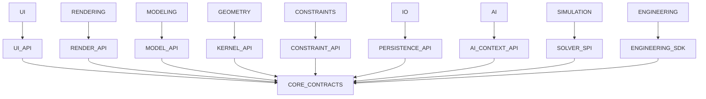

# Subsystem Swapability Report

## Current Status

After the recent cycle-removal refactor, the repository has:

- package-level cycles: none
- module-level cycles: none
- full regression status: `113 passed`

This does not mean the major subsystems are independently swappable today.

## Swappability Matrix

| Subsystem | Swappable Today | Why Not Fully Swappable |
|---|---|---|
| Geometry | No | Concrete types are imported directly by Rendering, Constraints, IO, Modeling, Design Context, and Tools |
| Rendering | No | UI imports concrete renderer and camera classes; rendering assumes concrete geometry primitives |
| Modeling | No | AI, Tools, and other packages consume concrete `PartModel`, `FeatureManager`, and `ModelBody` semantics |
| AI | No | AI imports concrete IO, Modeling, Constraints, and Data implementations |
| Simulation | Partial | Orchestration layer is isolated, but external consumers still use concrete simulation config/result types |
| UI | No | Concrete renderer and camera types are embedded in viewport abstractions |
| Constraints | No | Solver helpers depend on concrete geometry primitives and mutability contracts |
| IO | No | Import/export codecs and project snapshots depend on concrete geometry and project storage types |
| Engineering | No | Depends directly on concrete AI, IO, Data, and Simulation implementations |

## Target Adapter Boundaries

To make each subsystem swappable, V2 must introduce these contracts:

- Geometry Kernel API
- Geometry Query API
- Project Repository API
- Modeling Body / Feature Execution API
- Render Backend API
- Scene Tessellation API
- Constraint Entity API
- AI Context Provider API
- Simulation Solver SPI
- Engineering Plugin SDK

## Dependency Graph Proof Target

Independent swapability is only provable when major subsystems depend on contracts, not concrete peer implementations.

## Immediate Conclusion

EVILTECH CAD is now cycle-free, but not yet independently swappable at subsystem level. Adapter extraction is the next architectural prerequisite before industrial kernel, solver, and rendering backends can land safely.