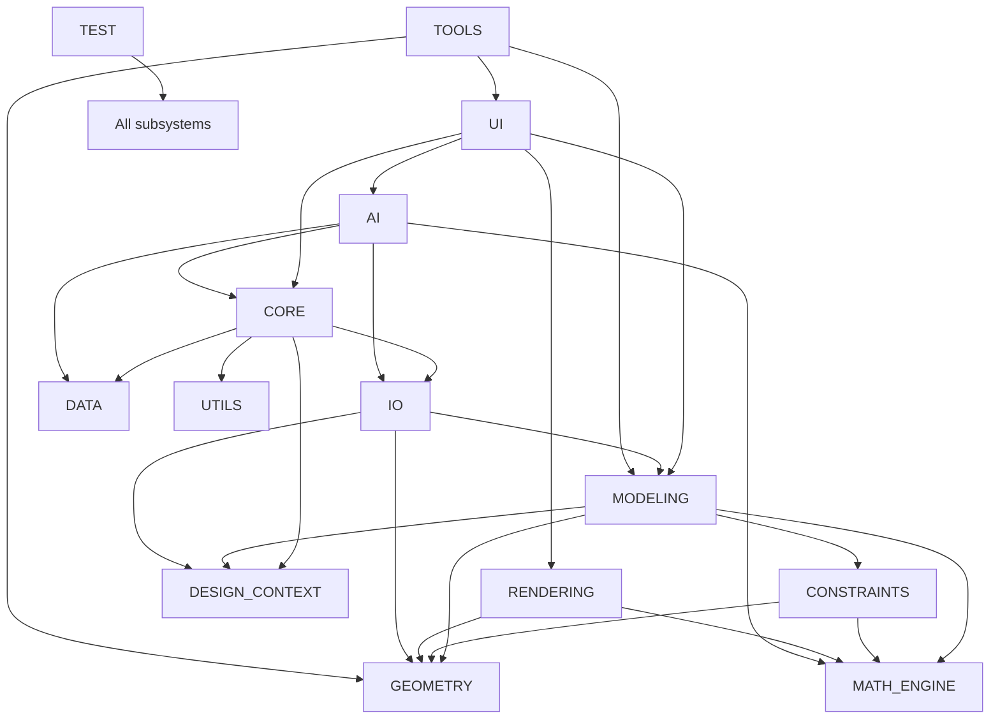

# EvilTech CAD Technology Stack Recommendation

## Executive Summary

EvilTech CAD should be treated as a long-lived, cross-domain engineering platform rather than a conventional CAD desktop application. The recommended stack therefore prioritizes:

- Strong numerical correctness
- Interoperability with engineering standards
- Extensibility for multiple domains
- Long-term maintainability
- Clear separation between core platform services and domain-specific modules

The stack below is selected to support mechanical, civil, structural, architectural, manufacturing, robotics, aerospace, electrical, plumbing, AI-assisted engineering, and scientific simulation workloads without locking the platform into a single application model.

---

## Technology Selection Principles

1. Prefer mature, well-supported open-source foundations where they are strong enough for core platform needs.
2. Prefer industry-standard file formats and exchange protocols over proprietary formats.
3. Use numerical and geometry libraries with proven engineering adoption rather than experimental alternatives.
4. Preserve architectural neutrality so that modules can evolve independently.
5. Favor technologies with strong licensing clarity and long maintenance horizons.
6. Avoid overcommitting to a single rendering or simulation stack too early; maintain abstraction boundaries.

---

## Recommended Technology Stack by Module

### 1. CORE

#### Required programming language
- Python 3.11+ for orchestration, scripting, and rapid platform integration
- Optional native components in C++ for performance-critical paths

#### Required libraries
- asyncio / concurrent.futures
- pydantic or equivalent schema validation
- tomllib / json / yaml support
- pluginlib-style discovery mechanisms
- logging and configuration frameworks

#### External SDKs
- None required at baseline
- Optional platform SDKs for desktop integration

#### Open-source technologies
- Python standard library
- Pluggy or similar plugin discovery patterns
- Structured logging and metrics libraries

#### Industry-standard technologies
- Service-oriented runtime patterns
- Event-driven orchestration
- Configuration-driven deployment

#### Mathematical libraries
- Not primary here

#### Rendering technologies
- Not primary here

#### Physics engines
- Not primary here

#### Geometry kernels
- Not primary here

#### Constraint solving technologies
- Not primary here

#### Serialization formats
- JSON, MessagePack, HDF5 for project metadata and large structured data

#### File standards
- UTF-8 project metadata
- Versioned project packages

#### Performance implications
- Python is suitable for orchestration but should not host heavy geometry or simulation kernels directly.

#### Licensing implications
- Python and standard-library-based approaches are permissive and low-risk.

#### Long-term maintenance risks
- Runtime fragmentation across Python versions if dependency management is weak.

#### Why this was selected over alternatives
- Python provides the best balance of rapid integration, scripting, ecosystem breadth, and compatibility for an extensible engineering platform.
- C++ should be reserved for performance-sensitive modules rather than forcing the entire core into a lower-level language.

---

### 2. AI

#### Required programming language
- Python 3.11+

#### Required libraries
- langchain-like orchestration abstractions only if needed
- openai-compatible client interfaces where external LLM services are used
- transformers or lightweight inference libraries for local models
- sentence-transformers or similar embedding libraries
- vector database interfaces

#### External SDKs
- OpenAI API SDK
- Azure OpenAI SDK if enterprise deployment is planned
- Hugging Face Hub SDK

#### Open-source technologies
- Hugging Face Transformers
- sentence-transformers
- FAISS or similar vector indexing
- llama.cpp or ONNX Runtime for local inference

#### Industry-standard technologies
- Retrieval-augmented generation
- Prompt orchestration
- Model evaluation and observability

#### Mathematical libraries
- NumPy
- SciPy

#### Rendering technologies
- Not primary

#### Physics engines
- Not primary

#### Geometry kernels
- Not primary

#### Constraint solving technologies
- Not primary

#### Serialization formats
- JSON for prompts and results
- Parquet for offline analysis datasets

#### File standards
- None at core level; domain-specific project context should remain structured and auditable

#### Performance implications
- AI inference can be a major latency source; context window and retrieval strategy must be constrained.

#### Licensing implications
- Open-source model libraries can be permissive, but some model weights and service terms may impose usage restrictions.

#### Long-term maintenance risks
- Rapid model ecosystem change can create portability and reproducibility issues.

#### Why this was selected over alternatives
- Python remains the strongest choice for AI orchestration because of the maturity of the surrounding ecosystem and the need for rapid experimentation.
- Local and cloud deployment options should both be supported through abstraction rather than hard-coding one provider.

---

### 3. GEOMETRY

#### Required programming language
- C++ for the core geometry kernel
- Python bindings for high-level workflows and scripting

#### Required libraries
- Eigen for linear algebra
- CGAL for robust computational geometry
- Boost.Geometry for geometry primitives and algorithms
- GMP / MPFR where exact arithmetic is needed

#### External SDKs
- None required at baseline

#### Open-source technologies
- CGAL
- Boost
- Eigen
- OpenCASCADE Technology (for a more comprehensive industrial geometry stack, if desired later)

#### Industry-standard technologies
- Boundary representation (B-rep)
- NURBS and spline representations
- Topological data structures

#### Mathematical libraries
- Eigen
- CGAL numerical components

#### Rendering technologies
- Not primary

#### Physics engines
- Not primary

#### Geometry kernels
- CGAL
- OpenCASCADE Technology
- Parasolid or ACIS only if commercial licensing is accepted later

#### Constraint solving technologies
- Not primary

#### Serialization formats
- STEP, IGES, STL, OBJ, GLTF for interchange

#### File standards
- STEP AP214/AP242
- IGES
- DXF
- STL
- OBJ

#### Performance implications
- Geometry kernels are computationally expensive; representation choices must be made carefully for scalability.

#### Licensing implications
- CGAL and Boost are permissive and widely used, but commercial support and integration complexity must be considered.
- OpenCASCADE Technology has a more complex licensing model and should be treated as an enterprise option, not a default choice.

#### Long-term maintenance risks
- A custom geometry kernel is high-risk and should be avoided unless the organization has deep geometry engineering resources.

#### Why this was selected over alternatives
- CGAL is the strongest open-source choice for robust computational geometry and is more sustainable than building a geometry engine from scratch.
- OpenCASCADE Technology is more comprehensive but heavier and more commercially constrained; it is better suited to later-stage enterprise integration.

---

### 4. MODELING

#### Required programming language
- C++ for performance-critical modeling operations
- Python for scripting and higher-level orchestration

#### Required libraries
- Geometry kernel API bindings
- Graph libraries for feature dependencies
- Versioned model state libraries
- Serialization and schema validation libraries

#### External SDKs
- None required at baseline

#### Open-source technologies
- CGAL
- Boost
- Eigen
- Qt for UI integration if needed

#### Industry-standard technologies
- Parametric feature modeling
- B-rep-based design history
- Assembly hierarchies and component references

#### Mathematical libraries
- Eigen
- SciPy for optimization workflows

#### Rendering technologies
- OpenGL / Vulkan for visualization integration

#### Physics engines
- Not primary

#### Geometry kernels
- CGAL or OpenCASCADE Technology as backend

#### Constraint solving technologies
- External solver integration, not a core modeling dependency

#### Serialization formats
- STEP, JSON-based model metadata, HDF5 for large datasets

#### File standards
- STEP AP242
- IFC for building-focused variants
- DWG/DXF for 2D drafting interoperability

#### Performance implications
- Feature history and model update propagation can become major performance bottlenecks.

#### Licensing implications
- Open-source geometry foundations are favorable; commercial kernel integration must be evaluated carefully.

#### Long-term maintenance risks
- Feature modeling systems become complex quickly; a clean dependency model is essential.

#### Why this was selected over alternatives
- A C++ core with a geometry kernel-backed modeling layer is appropriate because feature operations and model updates are performance-sensitive and need strong low-level control.
- Python should be used only as a high-level interface to preserve flexibility without sacrificing core performance.

---

### 5. CONSTRAINTS

#### Required programming language
- C++ for the solver core
- Python for orchestration and scripting

#### Required libraries
- Eigen
- SuiteSparse or similar sparse linear algebra libraries
- IPOPT or similar optimization backend for advanced solver workflows
- CAS libraries where symbolic constraint support is required

#### External SDKs
- None required at baseline

#### Open-source technologies
- SuiteSparse
- IPOPT
- Coin-OR tools where appropriate

#### Industry-standard technologies
- Constraint graph solving
- Numerical optimization
- Linear and nonlinear solver strategies

#### Mathematical libraries
- Eigen
- SciPy
- SuiteSparse

#### Rendering technologies
- Not primary

#### Physics engines
- Not primary

#### Geometry kernels
- Geometry kernel-backed constraint evaluation

#### Constraint solving technologies
- Coin-OR / IPOPT / custom graph-based solver pipeline

#### Serialization formats
- JSON for constraint definitions
- XML or YAML for solver configuration

#### File standards
- Standardized constraint metadata schemas

#### Performance implications
- Constraint solving can become a major bottleneck if full-system solves occur frequently.

#### Licensing implications
- Open-source optimization libraries are generally suitable and low-risk.

#### Long-term maintenance risks
- Constraint systems become difficult to support without a clear abstraction between domain constraints and solver backends.

#### Why this was selected over alternatives
- Open-source numerical optimization libraries are a strong fit because they have proven engineering adoption and support nonlinear and constrained workflows.
- A custom solver is not recommended unless the team has deep expertise and a strong need for specialized algorithms.

---

### 6. RENDERING

#### Required programming language
- C++ for the rendering engine core
- Optional shader and graphics pipeline support in Vulkan or OpenGL

#### Required libraries
- Vulkan or OpenGL
- GLFW / SDL for windowing
- GLM for graphics math
- Assimp for asset import
- stb_image or similar texture utilities

#### External SDKs
- None required at baseline
- Optional platform graphics SDKs for desktop integration

#### Open-source technologies
- Vulkan
- OpenGL
- GLFW
- GLM
- Assimp

#### Industry-standard technologies
- GPU-accelerated rendering
- Scene graphs
- Material and lighting pipelines

#### Mathematical libraries
- GLM
- Eigen

#### Rendering technologies
- Vulkan preferred for modern cross-platform rendering
- OpenGL as a fallback or compatibility layer

#### Physics engines
- Not primary

#### Geometry kernels
- Geometry libraries integrated at scene generation time

#### Constraint solving technologies
- Not primary

#### Serialization formats
- glTF, OBJ, STL, PLY

#### File standards
- glTF 2.0 for modern interoperable rendering assets

#### Performance implications
- GPU rendering is essential for large scene responsiveness.

#### Licensing implications
- Vulkan and OpenGL are well-supported and low-risk from a licensing standpoint.

#### Long-term maintenance risks
- Rendering stacks evolve quickly; a stable abstraction layer is important.

#### Why this was selected over alternatives
- Vulkan is the best long-term choice for a modern, cross-platform rendering engine because it offers explicit control and strong performance characteristics.
- OpenGL is acceptable as a compatibility path but should not be the primary long-term target.

---

### 7. MATH_ENGINE

#### Required programming language
- C++ for core numerical operations
- Python for high-level math workflows and scripting

#### Required libraries
- Eigen
- Boost
- NumPy
- SciPy
- CGAL numerical support where applicable

#### External SDKs
- None required at baseline

#### Open-source technologies
- NumPy
- SciPy
- Eigen
- Boost

#### Industry-standard technologies
- Linear algebra
- Numerical optimization
- Interpolation and transform pipelines

#### Mathematical libraries
- Eigen
- SciPy
- NumPy
- PETSc if large-scale scientific simulation is later required

#### Rendering technologies
- Not primary

#### Physics engines
- Not primary

#### Geometry kernels
- Geometry kernels for geometric math integration

#### Constraint solving technologies
- Solver backends such as IPOPT and SuiteSparse

#### Serialization formats
- HDF5 for scientific datasets
- JSON for lightweight metadata

#### File standards
- Not primary

#### Performance implications
- Numerical libraries must be selected carefully for both precision and performance.

#### Licensing implications
- Open-source scientific computing stacks are widely accepted and low-risk.

#### Long-term maintenance risks
- Scientific computing stacks can become highly specialized and require careful version governance.

#### Why this was selected over alternatives
- NumPy and SciPy provide the strongest ecosystem for scientific and engineering computation in Python, while Eigen provides the performance foundation in C++.
- This combination balances accessibility and performance.

---

### 8. UI

#### Required programming language
- C++ with Qt for desktop UI
- Python for scripting and lightweight automation

#### Required libraries
- Qt Widgets / Qt Quick
- Qt Creator tooling
- QML where modern declarative UI patterns are needed

#### External SDKs
- Platform-specific desktop SDKs if needed

#### Open-source technologies
- Qt

#### Industry-standard technologies
- Cross-platform desktop UI
- Model-view-controller and command-based interaction patterns

#### Mathematical libraries
- Not primary

#### Rendering technologies
- Qt integration with Vulkan/OpenGL

#### Physics engines
- Not primary

#### Geometry kernels
- Not primary

#### Constraint solving technologies
- Not primary

#### Serialization formats
- JSON and XML for UI state and settings

#### File standards
- Not primary

#### Performance implications
- UI must remain responsive even when large models are loaded.

#### Licensing implications
- Qt is widely adopted and commercially viable, but licensing must be reviewed carefully for proprietary distribution.

#### Long-term maintenance risks
- UI frameworks can become a long-term dependency burden if the interface grows too complex.

#### Why this was selected over alternatives
- Qt offers the strongest cross-platform desktop application foundation for a professional engineering application and integrates well with C++-based graphics and geometry systems.
- Web-based UI is not ideal as the primary experience for a high-performance engineering workstation application.

---

### 9. DATA

#### Required programming language
- Python for catalogs and data pipelines
- C++ where large data processing becomes performance-sensitive

#### Required libraries
- pandas
- sqlite3 or DuckDB for embedded structured data
- SQLAlchemy or similar if relational data is required

#### External SDKs
- None required at baseline

#### Open-source technologies
- SQLite / DuckDB
- pandas

#### Industry-standard technologies
- Standards-based engineering data catalogs
- Versioned reference libraries

#### Mathematical libraries
- Not primary

#### Rendering technologies
- Not primary

#### Physics engines
- Not primary

#### Geometry kernels
- Not primary

#### Constraint solving technologies
- Not primary

#### Serialization formats
- JSON, Parquet, HDF5

#### File standards
- ISO and domain-specific standards catalogs where appropriate

#### Performance implications
- Embedded databases are strong for local projects; larger enterprise scenarios may need a server-backed data layer later.

#### Licensing implications
- Low risk for open-source embedded databases.

#### Long-term maintenance risks
- Data model drift can create compatibility issues across releases.

#### Why this was selected over alternatives
- Embedded SQL and columnar storage provide a strong balance of simplicity, performance, and local-first capability for engineering catalogs and project metadata.

---

### 10. IO

#### Required programming language
- C++ for parser and serializer performance
- Python for high-level integration and scripts

#### Required libraries
- OpenCascade or CGAL-based import/export integration where needed
- libdxfrw or similar for DXF support
- assimp for mesh-based formats
- ezdxf for DXF interoperability where Python is preferred

#### External SDKs
- None required at baseline

#### Open-source technologies
- assimp
- ezdxf
- libdxfrw

#### Industry-standard technologies
- STEP, IGES, STL, OBJ, DXF, IFC, glTF

#### Mathematical libraries
- Eigen

#### Rendering technologies
- Not primary

#### Physics engines
- Not primary

#### Geometry kernels
- Geometry kernel-backed import/export integration

#### Constraint solving technologies
- Not primary

#### Serialization formats
- STEP, IGES, XML, JSON, HDF5

#### File standards
- STEP AP242
- IFC
- DXF
- STL
- OBJ

#### Performance implications
- Parsing and translating large CAD files can be expensive and should be streamed where possible.

#### Licensing implications
- File parsers and translators are often open-source and low-risk, but some standards-related libraries may have restrictions.

#### Long-term maintenance risks
- Interoperability standards evolve; version compatibility must be managed carefully.

#### Why this was selected over alternatives
- The recommended stack focuses on widely adopted interchange formats and established parser libraries to maximize compatibility with existing engineering ecosystems.

---

### 11. TOOLS

#### Required programming language
- C++ for core tool operations
- Python for scripting and automation

#### Required libraries
- Geometry kernel interfaces
- Numerical libraries
- UI event integration libraries

#### External SDKs
- None required at baseline

#### Open-source technologies
- Geometry and numerical libraries already selected

#### Industry-standard technologies
- Feature editing, measurement, sectioning, transformation, and manufacturing preparation workflows

#### Mathematical libraries
- Eigen
- SciPy

#### Rendering technologies
- Vulkan/OpenGL view integration

#### Physics engines
- Not primary

#### Geometry kernels
- CGAL or OpenCASCADE Technology

#### Constraint solving technologies
- Solver integration where constraints are involved

#### Serialization formats
- JSON for tool parameters and histories

#### File standards
- Domain-appropriate standards for manufacturing and drafting operations

#### Performance implications
- Tool operations must remain interactive, especially on large selections.

#### Licensing implications
- Low-risk if the stack remains primarily open-source based.

#### Long-term maintenance risks
- Tool interfaces can become inconsistent if not standardized early.

#### Why this was selected over alternatives
- Tooling should reuse the same foundational geometry and numerical stack to ensure consistency across editing workflows.

---

### 12. TEST

#### Required programming language
- Python for test orchestration and high-level regression tests
- C++ for low-level unit tests where performance-sensitive kernels are involved

#### Required libraries
- pytest
- Catch2 for C++ tests
- GoogleTest where appropriate
- coverage and profiling tools

#### External SDKs
- None required at baseline

#### Open-source technologies
- pytest
- Catch2
- GoogleTest

#### Industry-standard technologies
- Unit, integration, regression, and performance testing

#### Mathematical libraries
- Not primary

#### Rendering technologies
- Not primary

#### Physics engines
- Not primary

#### Geometry kernels
- Geometry kernel test fixtures

#### Constraint solving technologies
- Solver regression testing infrastructure

#### Serialization formats
- JSON and YAML for test configuration

#### File standards
- Not primary

#### Performance implications
- Large geometry and simulation tests must be isolated and profiled.

#### Licensing implications
- Low risk.

#### Long-term maintenance risks
- Tests can become fragile without stable fixtures and deterministic data.

#### Why this was selected over alternatives
- Python-based test orchestration is ideal for fast iteration, while C++ test frameworks are appropriate for kernel-level validation.

---

### 13. UTILS

#### Required programming language
- Python and C++ depending on consumer needs

#### Required libraries
- Standard library helpers
- logging and configuration libraries
- hashing, serialization, and compression libraries

#### External SDKs
- None required at baseline

#### Open-source technologies
- Python stdlib, Boost, zlib, protobuf-style structured data where useful

#### Industry-standard technologies
- Structured logging, configuration management, and validation

#### Mathematical libraries
- Not primary

#### Rendering technologies
- Not primary

#### Physics engines
- Not primary

#### Geometry kernels
- Not primary

#### Constraint solving technologies
- Not primary

#### Serialization formats
- JSON, YAML, MessagePack

#### File standards
- UTF-8 and versioned schemas

#### Performance implications
- Utilities should remain lightweight and not introduce hidden overhead.

#### Licensing implications
- Low risk.

#### Long-term maintenance risks
- Utility layers can become a dumping ground for ad hoc logic if not governed.

#### Why this was selected over alternatives
- A small, disciplined utility layer avoids over-engineering and keeps common services simple and reusable.

---

### 14. DESIGN_CONTEXT

#### Required programming language
- Python for metadata and project history workflows
- C++ where history storage or large state transitions require performance care

#### Required libraries
- Versioned storage libraries
- Event log libraries
- Serialization and schema validation libraries

#### External SDKs
- None required at baseline

#### Open-source technologies
- SQLite / DuckDB
- JSON schema tooling

#### Industry-standard technologies
- Revision history
- Event sourcing-style audit trails
- Snapshot-based state management

#### Mathematical libraries
- Not primary

#### Rendering technologies
- Not primary

#### Physics engines
- Not primary

#### Geometry kernels
- Not primary

#### Constraint solving technologies
- Not primary

#### Serialization formats
- JSON, HDF5, binary delta snapshots where necessary

#### File standards
- Versioned project schemas

#### Performance implications
- History and annotation systems must be designed to avoid uncontrolled growth.

#### Licensing implications
- Low risk.

#### Long-term maintenance risks
- Historical state can become large and difficult to query unless retention and indexing are planned.

#### Why this was selected over alternatives
- Embedded structured storage is sufficient at the start and is more maintainable than a heavyweight database architecture until enterprise collaboration needs justify a distributed backend.

---

## Complete Technology Stack

### Core platform
- Python 3.11+
- C++17/20 for performance-critical kernels
- Qt for desktop UI
- Vulkan for rendering
- Eigen for linear algebra
- Boost for generic utilities
- SQLite / DuckDB for embedded storage
- JSON / HDF5 / MessagePack for serialization

### Geometry and modeling
- CGAL for computational geometry
- Optional OpenCASCADE Technology for broader industrial geometry support
- STEP / IGES / DXF / IFC / STL / OBJ / glTF interchange support

### Constraints and numerical analysis
- SuiteSparse
- IPOPT
- SciPy / NumPy
- Eigen

### AI and analytics
- Python AI runtime
- Hugging Face Transformers
- sentence-transformers
- FAISS or similar vector retrieval
- ONNX Runtime or llama.cpp for local inference

### Rendering
- Vulkan
- OpenGL compatibility layer
- GLM
- Assimp
- GLFW / SDL

### Testing
- pytest
- Catch2 / GoogleTest
- coverage and benchmarking tooling

---

## Dependency Map

---

## External Library Inventory

### High-priority libraries
- Qt
- Vulkan
- Eigen
- Boost
- CGAL
- NumPy
- SciPy
- SuiteSparse
- IPOPT
- Assimp
- GLFW / SDL
- SQLite / DuckDB
- pytest
- Catch2 / GoogleTest
- Hugging Face Transformers
- sentence-transformers
- FAISS

### Medium-priority libraries
- ezdxf
- libdxfrw
- GLM
- pydantic
- SQLAlchemy

### Optional future libraries
- OpenCASCADE Technology
- PETSc
- specialized CFD or FEM libraries
- robotics motion planning libraries
- orbital mechanics libraries

---

## Third-party Risk Assessment

| Technology | Risk level | Reason |
|---|---|---|---|
| Qt | Medium | Excellent desktop support, but licensing must be reviewed for proprietary distribution |
| Vulkan | Low | Mature modern graphics API with strong cross-platform support |
| CGAL | Low-Medium | Powerful geometry support, but integration complexity is non-trivial |
| OpenCASCADE Technology | Medium | Powerful but more enterprise-oriented and licensing-sensitive |
| NumPy / SciPy | Low | Mature scientific ecosystem |
| SuiteSparse / IPOPT | Low-Medium | Strong numerical support, but solver integration can become complex |
| Hugging Face ecosystem | Medium | Fast-moving ecosystem; model compatibility and reproducibility require discipline |
| Assimp | Low | Good asset import support |
| SQLite / DuckDB | Low | Strong embedded storage choice |

---

## Future Upgrade Strategy

### Phase 1: Foundation
- Establish Python + C++ hybrid runtime
- Adopt Qt, Vulkan, Eigen, Boost, CGAL, SQLite/DuckDB
- Use STEP/IGES/OBJ/STL/glTF as core exchange formats

### Phase 2: Engineering Capability Expansion
- Add solver integrations for constraints and optimization
- Add industrial geometry and assembly support
- Add more sophisticated rendering and scene management

### Phase 3: Simulation and AI Expansion
- Introduce specialized simulation libraries for thermodynamics, CFD, structural, and orbital workflows
- Add AI context management and domain-specific assistants

### Phase 4: Enterprise Readiness
- Introduce enterprise-grade deployment, collaboration, and cloud integration where needed
- Evaluate more specialized commercial kernels if required by market scope

---

## Final Recommendation

The recommended technology stack is a hybrid platform architecture centered on:

- Python for orchestration, AI, automation, and high-level workflows
- C++ for performance-critical geometry, modeling, constraint solving, rendering, and numerical kernels
- Qt for desktop UI
- Vulkan for rendering
- CGAL as the default open-source geometry foundation
- Eigen, NumPy, SciPy, SuiteSparse, and IPOPT for numerical and constraint workflows
- SQLite / DuckDB for embedded storage
- STEP/IGES/IFC/DXF/STL/OBJ/glTF as core interoperability standards

This stack provides the strongest balance of technical capability, extensibility, and long-term sustainability for an Engineering Operating System of this scope without overcommitting to a single commercial vendor or a fragile custom implementation path.
