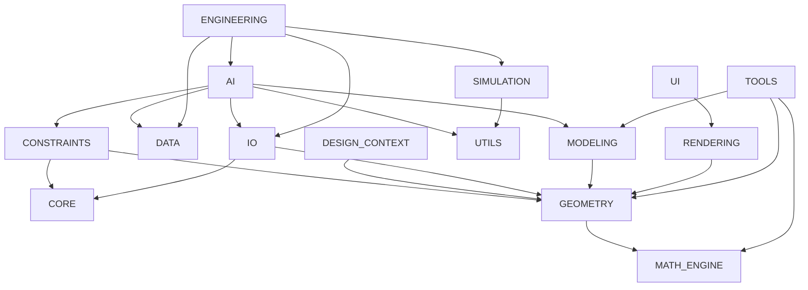
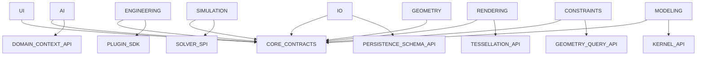

# Version 2.0 Architecture Blueprint

## Executive Summary

EvilTech CAD can evolve into an industrial CAD platform, but not by incrementally extending the current lightweight geometry and modeling internals. The current codebase is coherent, deterministic, and testable, but it is not yet structured around a true geometric kernel, persistent topology, backend-neutral rendering, industrial persistence, or solver/service plugin boundaries.

The repository is now free of package-level and module-level circular dependencies, but major subsystem swapability is still limited by concrete imports and underspecified domain contracts.

This blueprint defines the Version 2.0 architecture required before EVILTECH CAD can realistically compete with Siemens NX, CATIA, Creo, SolidWorks, Fusion 360, FreeCAD, and OpenCascade-based systems.

## 1. Current Geometry Layer and B-Rep Replaceability

### Current State

The current geometry layer is a custom deterministic primitive model, not a true B-Rep kernel.

- [GEOMETRY/topology.py](/workspaces/CAD_UNIVERSAL/EVILTECH_CAD/GEOMETRY/topology.py) exposes `BoundingBox`, `MeshTopology`, and `SolidTopology` as vertex containers only.
- [GEOMETRY/mesh.py](/workspaces/CAD_UNIVERSAL/EVILTECH_CAD/GEOMETRY/mesh.py) stores polygon meshes as `vertices + faces` index tuples.
- [GEOMETRY/solid.py](/workspaces/CAD_UNIVERSAL/EVILTECH_CAD/GEOMETRY/solid.py) stores solids as `vertices + optional mesh shells`.
- [MODELING/body.py](/workspaces/CAD_UNIVERSAL/EVILTECH_CAD/MODELING/body.py) stores only summary body statistics: volume, face count, edge count, body count, metadata.

### Incompatible Public and Quasi-Public Interfaces

The current geometry layer cannot be replaced by a true B-Rep kernel without interface adaptation because these types are semantically incompatible with industrial kernels:

- [GEOMETRY/topology.py](/workspaces/CAD_UNIVERSAL/EVILTECH_CAD/GEOMETRY/topology.py)
  - `MeshTopology(vertices: list[Point3D])`
  - `SolidTopology(vertices: list[Point3D])`
  - Missing topological entities: `Vertex`, `Coedge`, `Edge`, `Loop`, `Face`, `Shell`, `Lump`, `Body`
- [GEOMETRY/solid.py](/workspaces/CAD_UNIVERSAL/EVILTECH_CAD/GEOMETRY/solid.py)
  - `Solid(name, vertices, shells)` is not a kernel body contract
- [GEOMETRY/surface.py](/workspaces/CAD_UNIVERSAL/EVILTECH_CAD/GEOMETRY/surface.py)
  - `Surface(points)` is a planar polygon boundary, not a trimmed parametric surface
- [MODELING/body.py](/workspaces/CAD_UNIVERSAL/EVILTECH_CAD/MODELING/body.py)
  - `ModelBody` cannot express persistent topology, tolerance state, ownership, or B-Rep adjacency
- [MODELING/feature.py](/workspaces/CAD_UNIVERSAL/EVILTECH_CAD/MODELING/feature.py)
  - `FeatureManager.regenerate()` expects arithmetic body updates, not kernel transactions or journal replay
- [RENDERING/renderer.py](/workspaces/CAD_UNIVERSAL/EVILTECH_CAD/RENDERING/renderer.py)
  - visibility and bounds logic are hard-coded around primitive geometry assumptions
- [IO/step_io.py](/workspaces/CAD_UNIVERSAL/EVILTECH_CAD/IO/step_io.py)
  - import/export assumes simplified `Solid` and raw vertices

### Adapter-Based Migration Strategy

V2 should preserve the public Modeling and Rendering entry points where practical, but insert a kernel adapter layer.

Introduce these new contracts:

- `KernelSession`
- `KernelTransaction`
- `KernelBodyHandle`
- `KernelFaceHandle`
- `KernelEdgeHandle`
- `KernelVertexHandle`
- `KernelLoopHandle`
- `KernelSketchProfileHandle`
- `KernelQueryService`
- `KernelTessellationService`
- `KernelPersistenceCodec`

Migration phases:

1. Add a `GEOMETRY.kernel_api` contract package with opaque kernel handles and topology/query interfaces.
2. Reimplement [MODELING/body.py](/workspaces/CAD_UNIVERSAL/EVILTECH_CAD/MODELING/body.py) as a lightweight facade over `KernelBodyHandle` instead of scalar counters.
3. Keep `PartModel.primary_body()` and `FeatureManager.regenerate()` stable externally, but route internal work through `KernelTransaction`.
4. Add a compatibility adapter that can project kernel bodies into the current summary fields `volume`, `face_count`, and `edge_count` so older consumers still work.
5. Rework [RENDERING/renderer.py](/workspaces/CAD_UNIVERSAL/EVILTECH_CAD/RENDERING/renderer.py) to request tessellation through `KernelTessellationService` instead of directly interpreting geometry primitives.
6. Replace [IO/step_io.py](/workspaces/CAD_UNIVERSAL/EVILTECH_CAD/IO/step_io.py), [IO/iges_io.py](/workspaces/CAD_UNIVERSAL/EVILTECH_CAD/IO/iges_io.py), and related codecs with kernel-aware codecs.

## 2. Persistent Topological Naming System

### Current State

Persistent naming does not exist today.

- Faces, edges, loops, and vertices have no identity model.
- Sketch entities are not tracked as stable graph nodes.
- Feature regeneration in [MODELING/feature.py](/workspaces/CAD_UNIVERSAL/EVILTECH_CAD/MODELING/feature.py) replays arithmetic feature helpers and records summary snapshots only.

### Required V2 Topology Naming Architecture

Define a persistent identity stack:

- `DocumentId`
- `PartId`
- `FeatureId`
- `KernelJournalId`
- `TopologyId`
- `SketchEntityId`
- `ReferencePath`

Topology identity model:

- `TopologyId`: immutable logical identifier for a face, edge, loop, vertex, or body
- `KernelEntityHandle`: ephemeral runtime handle owned by the active kernel session
- `TopologyFingerprint`: geometry and adjacency fingerprint used for re-identification during regeneration
- `ReferencePath`: semantic path from feature history to resolved topology, such as `Part/Feature[Hole-3]/ResultFace[side-1]`

Required services:

- `TopologyJournal`
  - records kernel-level entity creation, split, merge, delete, replace events
- `TopologyNameResolver`
  - maps `ReferencePath` and prior `TopologyId` values to current kernel handles after regeneration
- `TopologyFingerprintMatcher`
  - reconciles topological drift using adjacency, UV-space, geometry class, and feature provenance
- `SketchIdentityGraph`
  - preserves stable IDs for profiles, curves, dimensions, constraints, and points
- `ReferenceRepairService`
  - resolves renamed, split, or ambiguous entities and creates repair diagnostics when matching is not unique

Naming rules:

- Every feature must emit a deterministic journal of created, consumed, modified, and deleted topology.
- Every topology result must be named semantically where possible: side face, cap face, start profile edge, etc.
- When semantic naming is not possible, use fingerprint and adjacency preservation.
- Downstream references never store kernel raw handles; they store `TopologyId` and `ReferencePath`.

This is the minimum required to approach Siemens NX-style stable references.

## 3. Adapter-Based Subsystem Decoupling

### Current Dependency Graph

After cycle removal, the current static package graph is:

### Current Violations

Remaining violations are concrete cross-package imports where stable adapters should exist.

- AI imports concrete Modeling, IO, Constraints, and Data implementations.
- Engineering imports concrete AI, IO, Data, and Simulation implementations.
- UI imports concrete Rendering implementations.
- Rendering imports concrete Geometry implementations.
- Constraints imports concrete Geometry implementations.
- IO codecs import concrete Geometry implementations.

### Target Swapability Graph

V2 target graph should route all major subsystem interaction through shared contracts and adapters:

### Required Adapter Interfaces

Introduce a shared contract layer with these interface groups:

- `ProjectSnapshotPort`
- `ProjectRepositoryPort`
- `PartModelPort`
- `AssemblyPort`
- `ConstraintSetPort`
- `GeometryQueryPort`
- `KernelTopologyPort`
- `TessellationPort`
- `RenderBackendPort`
- `AIContextPort`
- `AssistantKnowledgePort`
- `SimulationProblemPort`
- `SimulationJobPort`
- `MaterialCatalogPort`
- `EngineeringDisciplinePort`

### Immediate Adapter Refactor Priorities

High-leverage first migrations:

1. UI <-> Rendering
   - Replace [UI/viewport.py](/workspaces/CAD_UNIVERSAL/EVILTECH_CAD/UI/viewport.py) concrete `Renderer`, `BaseCamera`, and `CameraController` imports with `ViewportRenderPort`, `CameraPort`, and `CameraControllerPort`.
2. Engineering <-> AI / IO / Simulation / Data
   - Replace direct imports in [ENGINEERING/ai_integration.py](/workspaces/CAD_UNIVERSAL/EVILTECH_CAD/ENGINEERING/ai_integration.py), [ENGINEERING/sample_project_generator.py](/workspaces/CAD_UNIVERSAL/EVILTECH_CAD/ENGINEERING/sample_project_generator.py), [ENGINEERING/material_integration.py](/workspaces/CAD_UNIVERSAL/EVILTECH_CAD/ENGINEERING/material_integration.py), and [ENGINEERING/simulation_integration.py](/workspaces/CAD_UNIVERSAL/EVILTECH_CAD/ENGINEERING/simulation_integration.py) with provider interfaces.
3. AI <-> Modeling / IO / Constraints / Data
   - Replace direct concrete imports in [AI/context_builder.py](/workspaces/CAD_UNIVERSAL/EVILTECH_CAD/AI/context_builder.py), [AI/ANALYSIS/design_snapshot_builder.py](/workspaces/CAD_UNIVERSAL/EVILTECH_CAD/AI/ANALYSIS/design_snapshot_builder.py), and the `AI/DATA` loaders with context-provider protocols.
4. Rendering <-> Geometry
   - Replace direct primitive assumptions in [RENDERING/renderer.py](/workspaces/CAD_UNIVERSAL/EVILTECH_CAD/RENDERING/renderer.py), [RENDERING/camera.py](/workspaces/CAD_UNIVERSAL/EVILTECH_CAD/RENDERING/camera.py), and [RENDERING/overlays.py](/workspaces/CAD_UNIVERSAL/EVILTECH_CAD/RENDERING/overlays.py) with geometry query and tessellation ports.
5. Constraints <-> Geometry
   - Replace direct `Point3D`, `Line`, and `Circle` assumptions in [CONSTRAINTS/constraint_solver.py](/workspaces/CAD_UNIVERSAL/EVILTECH_CAD/CONSTRAINTS/constraint_solver.py) and [CONSTRAINTS/geometric_constraints.py](/workspaces/CAD_UNIVERSAL/EVILTECH_CAD/CONSTRAINTS/geometric_constraints.py) with sketch/topology query ports.

### Swapability Verdict Today

Every major subsystem cannot be swapped independently today.

- Geometry: no
- Rendering: no
- Modeling: no
- AI: no
- Simulation: partially, but not with industrial solver semantics
- UI: no
- Constraints: no
- IO: no
- Engineering: no

V2 swapability depends on the adapter layer above.

## 4. Modeling Engine Redesign

### Current State

[MODELING/feature.py](/workspaces/CAD_UNIVERSAL/EVILTECH_CAD/MODELING/feature.py) is a deterministic feature replay manager, not an industrial history-based modeler.

Missing architectural pieces:

- kernel transactions
- feature result journals
- persistent topology references
- regeneration graph invalidation
- dependency ownership and repair
- explicit rollback snapshots tied to kernel state

### V2 Modeling Architecture

Introduce:

- `FeatureDefinition`
- `FeatureExecutionPlan`
- `FeatureJournal`
- `FeatureDependencyGraph`
- `RegenerationContext`
- `KernelTransaction`
- `KernelRegenerationEngine`
- `ReferenceRepairReport`

Core workflow:

1. `FeatureManager.create_feature()` stores an immutable feature definition.
2. `FeatureDependencyGraph` computes the invalidation region.
3. `KernelRegenerationEngine` replays only affected features inside a `KernelTransaction`.
4. Each feature emits a `FeatureJournal` describing topology created, replaced, consumed, and failed.
5. `TopologyNameResolver` remaps downstream references.
6. `ParametricHistory` stores compact regeneration checkpoints, not only summary dicts.
7. Rollback restores the feature graph and associated kernel checkpoint.

Preserved APIs where possible:

- `PartModel.primary_body()`
- `FeatureManager.create_feature()`
- `FeatureManager.edit_feature()`
- `FeatureManager.rollback_to()`
- `FeatureManager.regenerate()`

These methods can remain, but their internals must be rebuilt on top of kernel transaction and journaling services.

## 5. Rendering Backend Abstraction

### Current State

[RENDERING/renderer.py](/workspaces/CAD_UNIVERSAL/EVILTECH_CAD/RENDERING/renderer.py) returns serializable frame dictionaries and assumes direct knowledge of geometry primitives.

### V2 Backend-Neutral Rendering Stack

Introduce:

- `RenderBackendPort`
- `RenderDevice`
- `RenderSwapchain`
- `RenderSceneGraph`
- `RenderResourceRegistry`
- `DrawCommandBuffer`
- `GeometryTessellationPort`
- `MaterialShaderPort`

Backends:

- `SoftwareRenderBackend`
- `OpenGLRenderBackend`
- `VulkanRenderBackend`
- `DirectXRenderBackend`
- `MetalRenderBackend`

Migration path:

1. Keep `Renderer.render(camera)` as the public API entry.
2. Replace frame-dict assembly with command-buffer generation.
3. Move primitive visibility and bounds logic into `GeometryTessellationPort` and `SceneCullingPort`.
4. Convert `RenderObject.geometry` to a stable scene-resource handle or tessellatable geometry adapter.
5. Make `OverlayRenderer` backend-neutral by emitting overlay scene primitives rather than JSON-only descriptors.

## 6. Solver Plugin Architecture

### Current State

[SIMULATION/simulation_pipeline.py](/workspaces/CAD_UNIVERSAL/EVILTECH_CAD/SIMULATION/simulation_pipeline.py) is an orchestration loop only. It does not define a production solver service provider interface.

### V2 Solver SPI

Introduce a plugin-driven solver architecture:

- `SolverPlugin`
- `SolverCapability`
- `SolverRegistry`
- `SimulationProblemDefinition`
- `SimulationMeshPort`
- `BoundaryConditionPort`
- `MaterialLawPort`
- `ResultFieldPort`
- `SolverExecutionContext`
- `SolverCheckpoint`
- `SolverResultBundle`

Required solver families:

- FEA
- CFD
- thermal
- structural
- electromagnetic
- motion / multibody dynamics
- optimization
- orbital / mission / systems solvers

Plugin lifecycle:

1. Plugin registers capabilities and schema support.
2. Simulation Manager resolves plugin based on problem definition.
3. Plugin validates mesh, materials, BCs, and solver options.
4. Plugin executes locally, remotely, or through external processes.
5. Plugin emits typed checkpoints and result bundles.

## 7. Industrial Project Persistence

### Current State

The IO package persists JSON snapshots and lightweight asset registries. It is adequate for deterministic testing, not for industrial assemblies.

### V2 Persistence Requirements

Introduce:

- `ProjectManifest v2`
- `SchemaVersionRegistry`
- `StreamingProjectRepository`
- `ChunkStore`
- `CompressionCodecRegistry`
- `PartialLoadIndex`
- `TopologyPersistenceStore`
- `RecoveryJournal`

Key capabilities:

- versioned schemas
- chunked binary and structured storage
- compression
- partial assembly loading
- lazy body/topology streaming
- persistent topology references
- journaled recovery
- large-model diff and merge support

Recommended persistence split:

- manifest and metadata: structured JSON or CBOR
- geometry and topology: chunked binary
- tessellation caches: derived cache buckets
- simulation results: field-store chunks
- AI traces and engineering reports: append-only structured logs

## 8. Engineering Plugin SDK

### Current State

[ENGINEERING/engineering_registry.py](/workspaces/CAD_UNIVERSAL/EVILTECH_CAD/ENGINEERING/engineering_registry.py) hard-codes all discipline specifications in a central registry.

### V2 Engineering SDK

Introduce:

- `EngineeringPlugin`
- `DisciplineManifest`
- `CalculationProvider`
- `ValidationProvider`
- `StandardsProvider`
- `MaterialProvider`
- `SimulationProvider`
- `ReportProvider`
- `AIContextProvider`
- `UIContributionProvider`

Plugin example capabilities:

- calculations
- standards catalogs
- material mappings
- discipline-specific panels and workflows
- AI context adapters
- simulation problem builders
- report sections

This allows new disciplines to ship as independent packages without modifying the core registry.

## 9. Migration Order, Complexity, and Risks

### Phase 0: Completed in this pass

- Remove module-level circular dependencies in IO and Modeling

### Phase 1: Contract Layer Extraction

- Create shared adapter contracts for project, modeling, rendering, AI context, geometry query, and simulation requests
- Complexity: medium
- Risk: low to medium

### Phase 2: Geometry Kernel Boundary

- Add kernel API and body/query/tessellation adapters
- Complexity: very high
- Risk: very high

### Phase 3: Modeling Engine Rebuild

- Move feature replay onto kernel transactions and journaling
- Complexity: very high
- Risk: very high

### Phase 4: Persistent Naming and Reference Repair

- Add topology journal, fingerprint matching, and stable references
- Complexity: extreme
- Risk: extreme

### Phase 5: Rendering Backend Abstraction

- Introduce backend-neutral render device and tessellation API
- Complexity: high
- Risk: high

### Phase 6: Solver Plugin SPI and Typed Problems

- Replace framework-only simulation payloads with typed solver plugin architecture
- Complexity: high
- Risk: high

### Phase 7: Industrial Persistence

- Replace JSON-only snapshots with versioned, chunked, partially loadable persistence
- Complexity: very high
- Risk: very high

### Phase 8: Engineering Plugin SDK

- Replace hard-coded discipline registry with plugin-discovered discipline packages
- Complexity: medium to high
- Risk: medium

### Phase 9: AI Contract Isolation

- Move AI to pure adapter consumption of project, model, and simulation context
- Complexity: medium
- Risk: medium

## 10. Industrial CAD Gap Analysis

Ranked by architectural importance, not implementation difficulty.

### Tier 1: Existential Gaps

1. True B-Rep kernel boundary
2. Persistent topological naming and reference repair
3. History-based modeling on kernel transactions
4. Industrial persistence for large assemblies
5. Solver service provider architecture with typed problems/results

### Tier 2: Competitive Core Gaps

6. GPU backend abstraction and tessellation pipeline
7. Assembly-scale lightweight loading and selective regeneration
8. Standards-based material, meshing, and analysis problem models
9. Constraint architecture split between sketch, 3D, assembly, and driven/reference solving
10. Plugin SDK for disciplines and capabilities

### Tier 3: Ecosystem and Productivity Gaps

11. Drafting/PMI/MBD architecture
12. CAM/manufacturing workflow architecture
13. enterprise data / PLM integration architecture
14. collaboration and revision control architecture
15. automation, scripting, and external application SDK

### Product Comparison Summary

- Siemens NX / CATIA / Creo
  - Ahead in kernel depth, persistent naming, assembly scale, solver integration, data management, manufacturing, and enterprise workflows
- SolidWorks / Fusion 360
  - Ahead in practical history modeling, UI maturity, plugin ecosystems, and production CAD workflows
- FreeCAD / OpenCascade
  - Ahead in real geometric kernel infrastructure and CAD topology semantics

EVILTECH CAD currently compares more closely to a deterministic architectural prototype than a production CAD platform.

## 11. Final Verdict

Version 2.0 must redesign Geometry, Modeling, Rendering internals, Simulation problem architecture, IO persistence, Engineering extensibility, and AI integration boundaries before EVILTECH CAD can credibly compete with industrial systems.

The good news is that the codebase is now cycle-free and structurally simple enough to refactor in stages. The bad news is that the required redesign is foundational, not incremental.